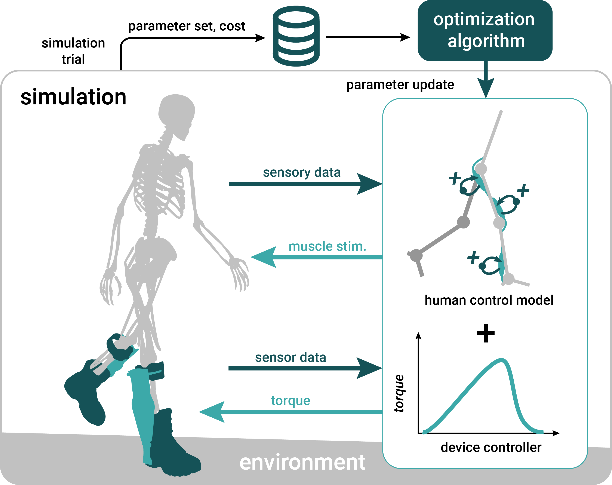

# Controller Optimization

**Reflex-based controller for assistive devices using parameter optimization**

<div style="text-align: center;">
  
</div>

Controller optimization in MyoAssist tunes a reflex-based musculoskeletal controller together with exoskeleton controllers. It uses CMA-ES (Covariance Matrix Adaptation Evolution Strategy) to produce controllers for diverse performance objectives.

## Optimization Workflow

1. **Setup**: Configure your musculoskeletal model and exoskeleton controller
2. **Define Objectives**: Specify environment configuration, cost functions, and optimization criteria
3. **Optimize**: Run CMA-ES optimization to find optimal controller parameters
4. **Monitor Progress**: Track CMA-ES progress and output cost values
5. **Analyze Results**: Evaluate results and visualize performance

## Key Features

- **Reflex Control Optimization**: Optimize reflex-based controllers using CMA-ES
- **Exoskeleton Control Testing**: Design, deploy, and optimize controllers for various assistive devices
- **Result Analysis**: Built-in tools for processing and visualizing optimization results

### Key Scripts

- **`run_ctrl_minimal.py`**: Simple reflex control testing with random parameters
- **`run_ctrl.py`**: Full simulation with video generation and parameter loading
- **`run_optim.py`**: CMA-ES optimization runner for controller tuning
- **`run_eval.py`**: Results evaluation and analysis

<div style="display: flex; gap: 20px; margin: 20px 0;">
  <div class="info-box" style="flex: 1; margin: 0;">
    <h4>Getting Started</h4>
    <p>Learn the basics of reflex control and start your first optimization</p>
    <ul>
      <li><a href="Running_Reflex_Control">Running Reflex Control</a></li>
      <li><a href="Running_Optimizations">Running Optimizations</a></li>
      <li><a href="../evaluation/">Evaluation</a></li>
    </ul>
  </div>
  <div class="info-box" style="flex: 1; margin: 0;">
    <h4>Additional Topics and Tools</h4>
    <p>Customize cost functions and analyze optimization results</p>
    <ul>
      <li><a href="Exoskeleton_Controllers">Exoskeleton Controllers</a></li>
      <li><a href="Amputee_Prosthetic_Control">Amputee and Prosthetic Control</a></li>
      <li><a href="Understanding_Cost">Cost Functions</a></li>
      <li><a href="Reflex_Control_Overview">Reflex Control</a></li>
    </ul>
  </div>
</div>

<div style="text-align: center; margin: 20px 0;">
  
</div>

## Getting Started

### Codebase Structure

```
ctrl_optim/
├── run_ctrl_minimal.py          # Quick testing script
├── run_ctrl.py                  # Main simulation script
├── run_optim.py                 # Optimization runner
├── run_eval.py                  # Evaluation script
├── results/
│   ├── evaluation_outputs/      # Simulation videos and outputs
│   ├── optim_results/           # Optimization results
│   └── preoptimized/            # Pre-optimized controllers
├── ctrl/                        # Controller implementations
│   ├── reflex/                  # Reflex controller modules
│   ├── exo/                     # Exoskeleton controller modules
│   └── prosthetic/              # Prosthetic ankle controllers
└── optim/                       # Optimization framework
    ├── cost_functions/          # Cost function implementations
    ├── config/                  # Argument parsing and environment code
    └── training_configs/        # Training configurations
```


### Basic Reflex Control

Start with the minimal script to run reflex control:

```bash
cd ctrl_optim
python run_ctrl_minimal.py
```

This script:
- Creates 77 random control parameters (the 2D reflex total; see [Reflex Control](Reflex_Control_Overview) for the other modes)
- Runs a 5-second simulation with default settings
- Reports walking duration
