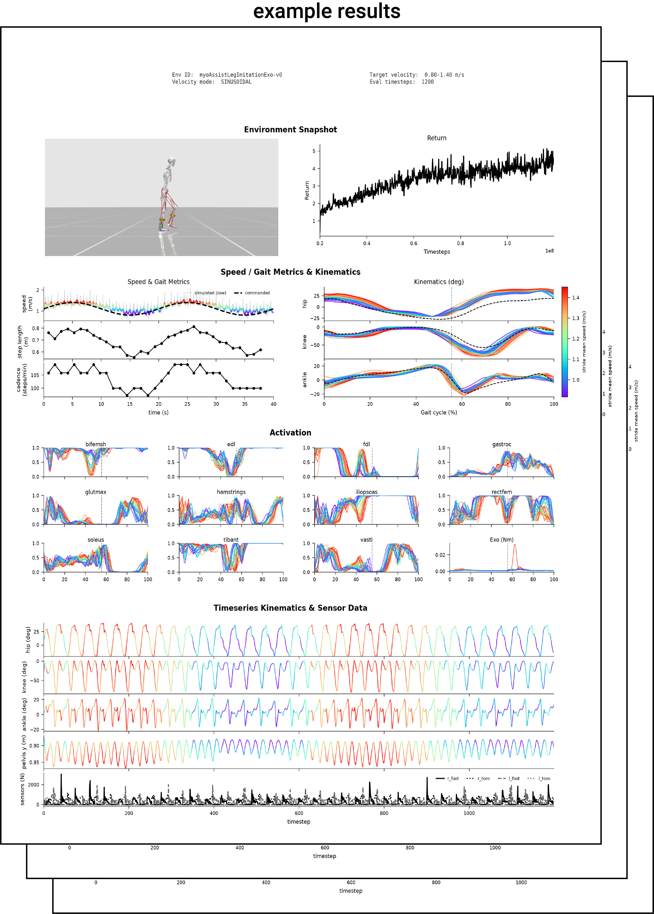

# Evaluation

Both MyoAssist training frameworks use one evaluation pipeline. The pipeline runs a
trained RL policy or an optimized reflex controller in its composed environment. It
then makes the same output files for each framework. You can then compare the results
from the two frameworks directly.

Each framework has a different entry point:

- **Reinforcement Learning (RL)**: `rl_train/run_policy_eval.py`
- **Controller Optimization (CO)**: `ctrl_optim/run_eval.py`

The shared code in `myoassist_utils/eval_utils.py` makes the outputs for both.

## Shared outputs

Each evaluation makes these files:

- **`gait_evaluated_data.json`**: the full rollout in the `GaitData` schema. The analyzer that
  runs during training names it `gait_evaluated_data_[NN].json` instead. This
  includes the joint `qpos` and `qvel`, the actuator force and ctrl, the sensor data,
  and the target velocity. CO also writes this RL schema, so the RL analyzers can read
  CO output.
- **`composite.png`** (with a matching `.svg`): one summary figure with several
  panels. The shared builder `myoassist_utils/eval_utils.py` (`build_composite` and
  `CompositeInputs`) makes it.
- **`replay.mp4`**: an optional replay video from a follow camera.

## The composite figure

<div style="display: flex; gap: 1.5rem; align-items: flex-start; flex-wrap: wrap;">
<div style="flex: 1 1 340px; min-width: 0;" markdown="1">

`composite.png` is a single summary figure with several panels that together
characterize one rollout. Most panels are shared across both frameworks, and one panel
is framework-specific. The example to the right is one such figure.

- **Environment snapshot**: a render of the model partway through the rollout.
- **Optimization progress**: the training return per update (RL), or the CMA-ES
  fitness per generation (CO).
- **Speed and kinematics**: commanded against achieved speed, gait metrics, and the
  hip, knee, and ankle angles across the gait cycle, drawn on a human gait reference.
- **Activation**: a grid of the muscle activations, with the exo torque.
- **Timeseries**: the joint angles, the pelvis height, and the foot-contact sensors
  over the full rollout.

The exact panels vary with the environment and the eval settings. MyoAssist defines
the environment the same way everywhere: a `{msk, device, terrain}` env-spec of raw
registry keys. See [Defining an Environment](../getting-started/defining-an-environment).

</div>
<div style="flex: 0 0 auto; text-align: center;">
  
  <div class="fig-caption"><i>Example composite figure</i></div>
</div>
</div>

## Reinforcement Learning: `run_policy_eval.py`

Run `run_policy_eval.py` on a `train_session_*` directory from your training run:

```bash
python rl_train/run_policy_eval.py [path/to/train_session_folder]
```

It makes one `analyze_results_NN/` folder for each entry in the `evaluate_param_list`.
You set the `evaluate_param_list` in the session's `session_config.json`. The tool
writes the folders in the `train_session` directory:

```
rl_train/results/train_session_[date-time]/analyze_results_[NN]/
├── composite.png              # summary figure
├── composite.svg              # vector version
├── replay.mp4                 # rollout replay video
└── gait_evaluated_data.json   # rollout data in the GaitData schema
```

The `evaluate_param_list` sets which rollouts to evaluate. It sets the velocity mode,
the timesteps, the camera, and other values. Refer to the
[RL Configuration](../reinforcement-learning/02_configuration) page. To also write the
legacy per-panel plots, use `--legacy-plots`.

## Exoskeleton policy scoring

Two tools in `tools/` read the rollout JSON from an `analyze_results_NN/` folder. They run
no simulation of their own. Both compute every gait-cycle quantity in that leg's own cycle.

### `score_exo_policy.py`

Scores a trained exo policy on three axes and prints a ranked report. Use it to order runs
that all walk, which the composite figure cannot separate.

- **stability**: cycle-to-cycle scatter, peak count, and slew of the torque profile.
- **symmetry**: left-right difference in peak magnitude and phase.
- **plausibility**: agreement with walking literature values. The ankle plantarflexion
  moment peaks near 50 % of the gait cycle, a powered ankle exo delivers a peak of
  0.15-0.80 N*m/kg, and stance occupies about 60 % of the cycle.

Each subscore and their mean (`total`) run from 0 to 1.

```bash
python tools/score_exo_policy.py rl_train/results/train_session_*/analyze_results_00
```

| Flag | Meaning | Default |
|------|---------|---------|
| `--joint {ankle,hip}` | joint the device assists | `ankle` |
| `--mass` | body mass for N*m/kg normalization | `90.96` |
| `--json-out` | also write every score to this JSON file | none |
| `--skip-unscorable` | continue past rollouts with too few foot strikes to segment | off |
| `--by-name` | order the report by directory name instead of by score | off |

Only the ankle path is validated against composed models. The hip window is provisional, so
scoring a hip device prints a warning.

Two constraints on the ranking:

- Evaluate with enough steps. The configs ship `num_timesteps` 200, about 5 strides, which
  is too few for a per-phase quantity. Use `--steps 1000` for about 30.
- Rank with this tool, not with the `train/mirror_loss` metric. A policy can lower that loss
  by driving both exo outputs toward zero.

### `plot_kinematics_exo.py`

Writes one figure holding the hip, knee, and ankle angle of each leg against the mocap
reference, with that leg's exo torque underneath.

```bash
python tools/plot_kinematics_exo.py <run_dir> [<run_dir> ...] -o out.png
```

`--reference` sets the reference file, `rl_train/reference_data/segmented.npz` by default.
`--mass` matches `score_exo_policy.py`.

## Controller Optimization: `run_eval.py`

`run_eval` evaluates an optimized reflex controller. It reads a `_Best.txt` or
`_BestLast.txt` parameter file from an `optim_results` folder. It then runs the
controller in its composed environment and writes the shared outputs above.
`CtrlOptimGaitEvaluator` does the rollout, with the config `CtrlOptimEvalConfig`. The
follow camera comes from `ctrl_optim/eval/camera_setup.py`. The old Tkinter GUI eval
is removed.

Run this command from the repository root:

```bash
# Use a JSON config
python -m ctrl_optim.run_eval --config ctrl_optim/eval/configs/example_config.json

# Or give a results directory. CLI flags set the other values.
python -m ctrl_optim.run_eval --results-dir ctrl_optim/results/preoptimized/exo_4param_125_0729_1339
```

If you give a results directory, `run_eval` finds the files in it. It finds the
parameter file (`*_Best.txt` or `*_BestLast.txt`, from `param_type`) and the CMA-ES
pickle (`*_Pickle.pkl`). A window shows the composite figure. To prevent this window,
use `--no-show`.

### JSON configuration

Copy `ctrl_optim/eval/configs/example_config.json` and give it a new name. Set your
values in it. You can omit a field that has a default. The pipeline reads these keys:

| Key | Meaning | Default |
|-----|---------|---------|
| `results_dir` | folder with the optimized run | (required) |
| `param_type` | `"Best"` or `"BestLast"`; which param file to load | `"Best"` |
| `param_file` | explicit param `.txt`; found from `param_type` if null | auto |
| `pkl_file` | explicit CMA-ES `_Pickle.pkl`; found if null | auto |
| `output_dir` | where the pipeline writes outputs | `<results_dir>/eval_output` |
| `sim_time` | rollout length (s) | `10.0` |
| `target_velocity` | target walking speed (m/s), for readouts | `1.25` |
| `mode` | `"2D"` or `"3D"` | `"2D"` |
| `init_pose` | start keypose | `"walk_left"` |
| `delayed` | biological neural delays | `false` |
| `exo_bool` | exoskeleton on | `true` |
| `fixed_exo` | hold exo params fixed | `false` |
| `use_4param_spline` | 4-param or n-point exo spline | `true` |
| `max_torque` | max exo torque | `1.0` |
| `n_points` | n-point spline points (when not 4-param) | `4` |
| `msk_key` | human MSK registry key | `"myolegs22"` |
| `device_key` | assist_sim device registry key | `"Tutorial_L1"` |
| `terrain` | terrain spec (path or inline); sets the slope | flat if null |
| `camera_speed` / `camera_distance` / `camera_elevation` / `camera_height` / `camera_azimuth` | follow-camera setup | see config |
| `render_width` / `render_height` | render resolution | `1920` x `960` |
| `show_actuators` | draw actuators in the render | `true` |
| `export_video` | also write `replay.mp4` | `false` |
| `video_fps` | replay frame rate | `100` |

The terrain sets the course grade. A `slope` `terrain` gives the incline. There is no
separate slope flag.

### CLI overrides

You can use flags instead of a config, or together with a config. A flag always
replaces the JSON value.

```bash
python -m ctrl_optim.run_eval --results-dir <dir> \
    --param-type BestLast --sim-time 20 --target-velocity 1.25 \
    --mode 2D --exo-bool true --export-video --no-show
```

These flags are available: `--config`, `--results-dir`, `--param-file`, `--pkl-file`,
`--output-dir`, `--param-type {Best,BestLast}`, `--sim-time`, `--target-velocity`,
`--mode {2D,3D}`, `--init-pose`, `--exo-bool`, `--export-video`, `--no-show`.

## Quick visualization

To make a quick video without the full analysis figure, use one of these scripts. For
CO, use `run_ctrl.py` (refer to
[Running Reflex Control](../controller-optimization/Running_Reflex_Control)). For RL,
use `run_sim_minimal.py`.
