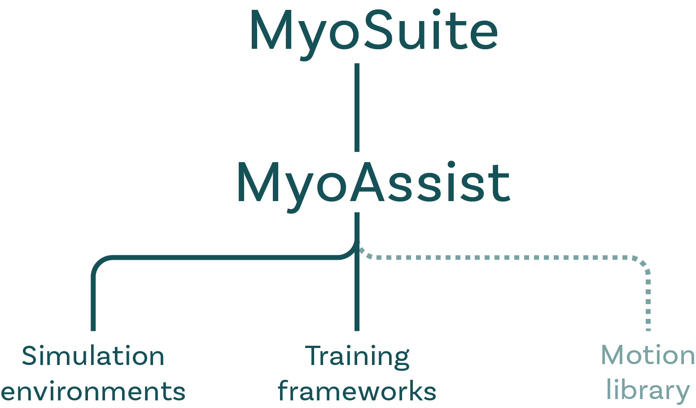

# MyoAssist

**An open-source Python toolkit for simulating and optimizing assistive devices in neuromechanical simulations**

  

    
    <!-- 
Flat Terrain
 -->
  

MyoAssist is a package within [**MyoSuite**](https://sites.google.com/view/myosuite), a collection of musculoskeletal environments built on [**MuJoCo**](https://mujoco.org/) for reinforcement learning and control research. It is developed and maintained by the [**NeuMove Lab**](https://neumove.org/) at Northeastern University. We aim to bridge neuroscience, biomechanics, robotics, and machine learning to advance the design of assistive devices and deepen our understanding of human movement.

   

MyoAssist consists of three main components that together support simulation, training, and analysis of human–device interaction:

## 1. **Simulation Environments**
Forward simulations that combine musculoskeletal models with assistive devices.

- **Gait-assistive** (lower limb): ankle and hip exoskeletons, and powered or passive prosthetic legs.
- **Upper-body and seated-mobility**: a back exosuit, a manual wheelchair, and a bimanual prosthetic-limb manipulation environment.
- Baseline controllers for common assistive scenarios.

See [Simulation Environments](modeling/) for the full catalog.

## 2. **Training Frameworks**
Tools to generate control policies or optimize behavior in simulation.

- **Reinforcement Learning (RL)**
  - **Framework**: Built on [Stable-Baselines3](https://stable-baselines3.readthedocs.io/en/master/) and [PyTorch](https://pytorch.org/)
  - **RL methods**: Standard reinforcement learning, imitation learning, and transfer learning
  - **Network architecture**: Modular multi-actor networks for separately controlling human and exoskeleton agents
- **Controller Optimization (CO)**
  - Reflex-based control models
  - CMA-ES for parameter tuning

## 3. **Motion Library** (planned)
A curated dataset of human movement, both real and simulated.

## Get started

- **[Getting Started](getting-started/)**: install MyoAssist and run the setup check.
- **[Defining an Environment](getting-started/defining-an-environment)**: the shared `{msk, device, terrain}` spec used by both pipelines.
- **[Simulation Environments](modeling/)**: the MSK models, devices, and terrains you can compose.
- **[Reinforcement Learning](reinforcement-learning/)** and **[Controller Optimization](controller-optimization/)**: the training frameworks.
- **[Evaluation](evaluation/)**: the shared results pipeline.
