# Device Catalog

This page shows the gait-assistive devices and the upper-body and seated-mobility
environments. For the human MSK models, see [MSK Models](../msk-models). Every device
composes with every MSK model. For the authoritative, installed set, run
`python -m assist_sim list`.

## Gait-assistive devices

Lower-limb exoskeletons and prosthetic legs, each shown composed with a myoLeg model.

<div class="device-grid">
  <div class="device-card">
    <div class="device-imgwrap">
      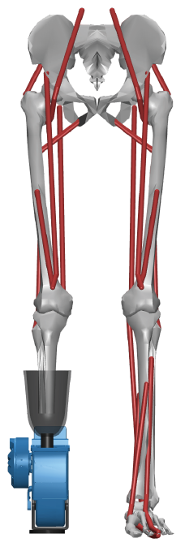
      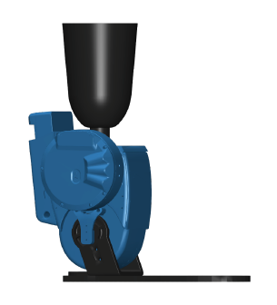
    </div>
    <div class="device-meta">
      <h3><code>OpenSourceLeg_A_L1</code> </h3>
      <p class="device-type">Transtibial prosthetic</p>
      <p>Open-Source Leg, ankle configuration.</p>
    </div>
  </div>
  <div class="device-card">
    <div class="device-imgwrap">
      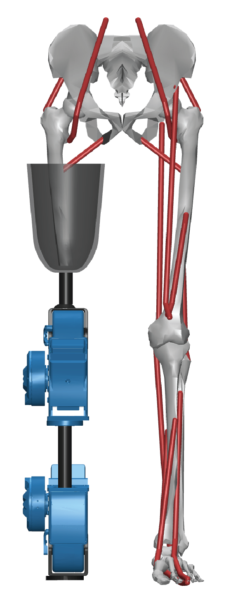
      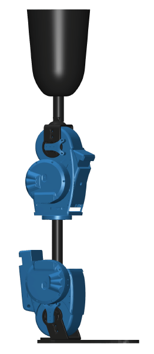
    </div>
    <div class="device-meta">
      <h3><code>OpenSourceLeg_KA_L1</code> </h3>
      <p class="device-type">Transfemoral prosthetic</p>
      <p>Open-Source Leg, knee-ankle configuration.</p>
    </div>
  </div>
  <div class="device-card">
    <div class="device-imgwrap">
      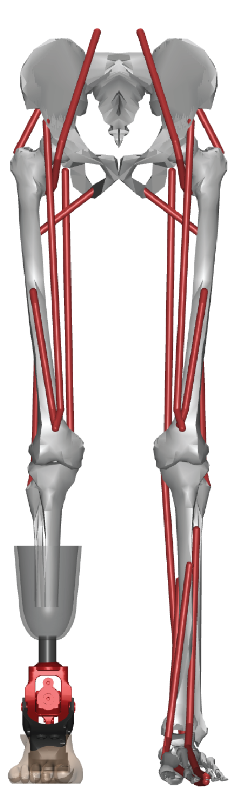
      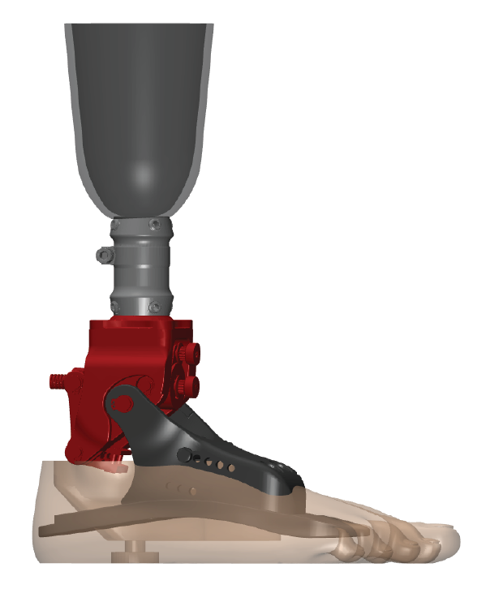
    </div>
    <div class="device-meta">
      <h3><code>KFoot_L1</code> </h3>
      <p class="device-type">Transtibial prosthetic</p>
      <p>Passive transtibial prosthetic with a spring-damper ankle.</p>
    </div>
  </div>
  <div class="device-card">
    <div class="device-imgwrap">
      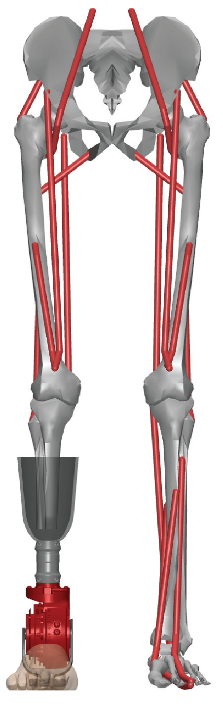
      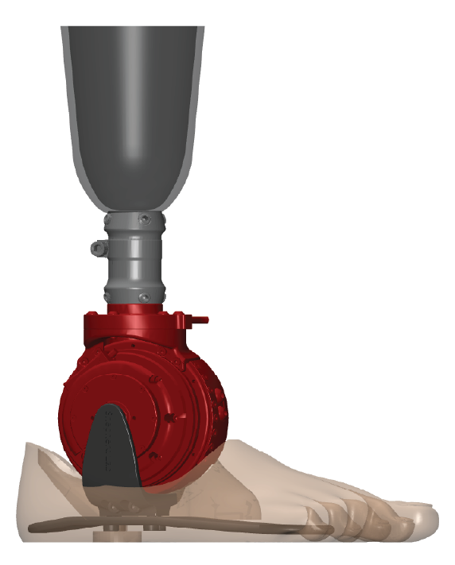
    </div>
    <div class="device-meta">
      <h3><code>NEUankle_L1</code> </h3>
      <p class="device-type">Powered transtibial prosthetic</p>
      <p>Powered transtibial prosthetic with an actively driven ankle.</p>
    </div>
  </div>
  <div class="device-card">
    <div class="device-imgwrap">
      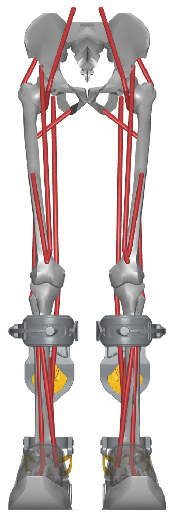
      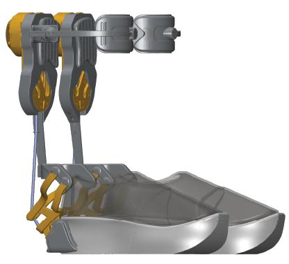
    </div>
    <div class="device-meta">
      <h3><code>STRIDE_L2</code> </h3>
      <p class="device-type">Cable-driven ankle exo</p>
      <p>Bilateral ankle exo with a closed six-bar linkage and Bowden cables.</p>
    </div>
  </div>
  <div class="device-card">
    <div class="device-imgwrap">
      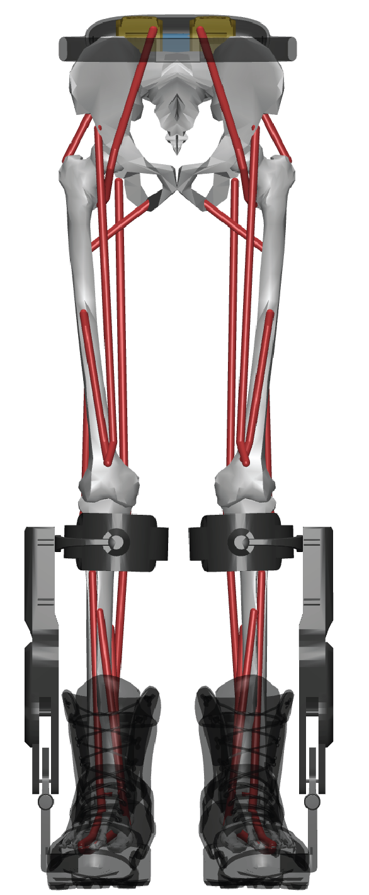
      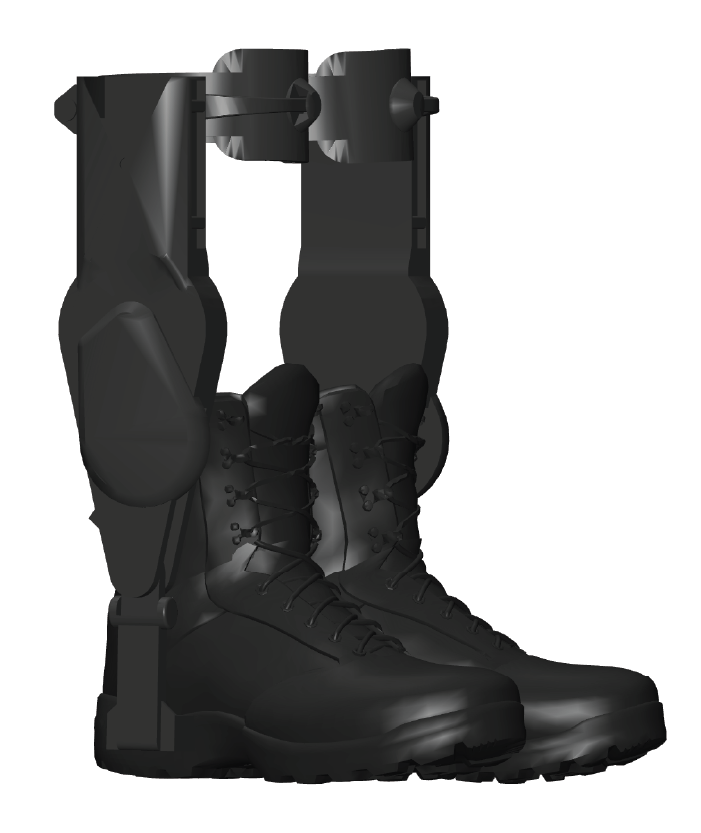
    </div>
    <div class="device-meta">
      <h3><code>DephyExoBoot_L1</code> 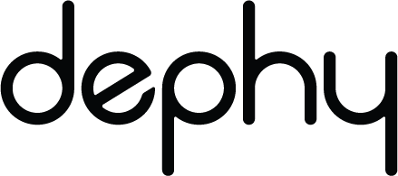</h3>
      <p class="device-type">Ankle exoskeleton</p>
      <p>Bilateral ankle exoskeleton (Dephy ExoBoot).</p>
    </div>
  </div>
  <div class="device-card">
    <div class="device-imgwrap">
      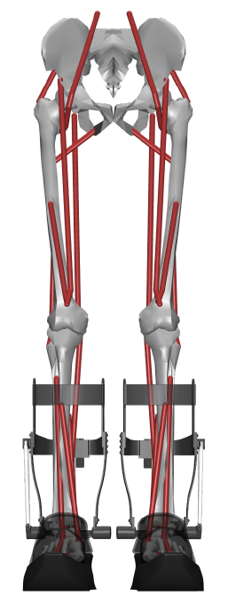
      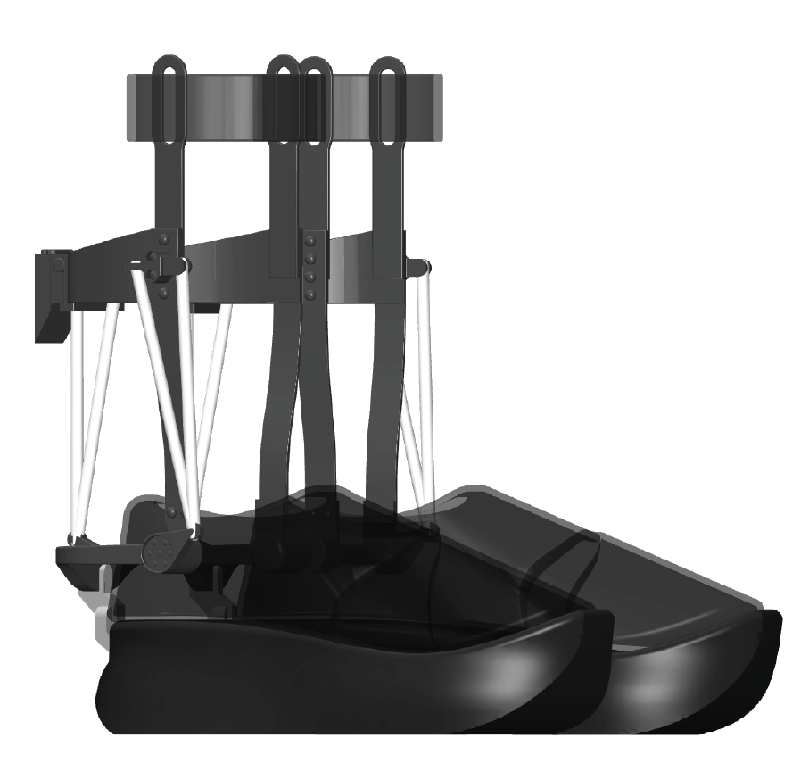
    </div>
    <div class="device-meta">
      <h3><code>Humotech_L1</code> </h3>
      <p class="device-type">Ankle exo with cables</p>
      <p>Bilateral ankle exo with plantarflexion and dorsiflexion cables.</p>
    </div>
  </div>
  <div class="device-card">
    <div class="device-imgwrap">
      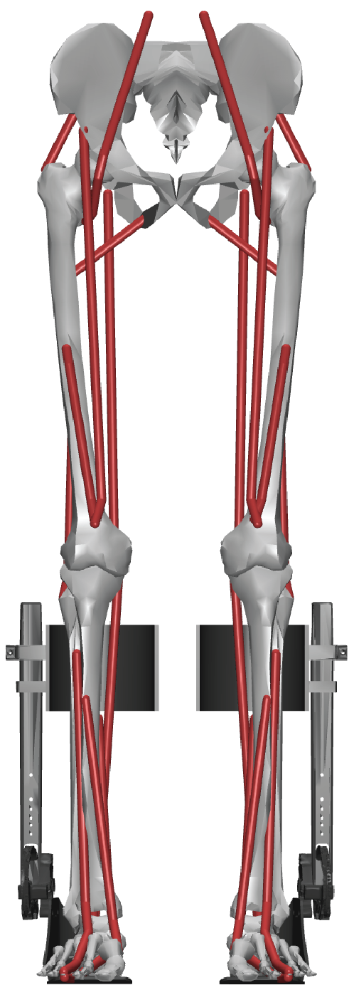
      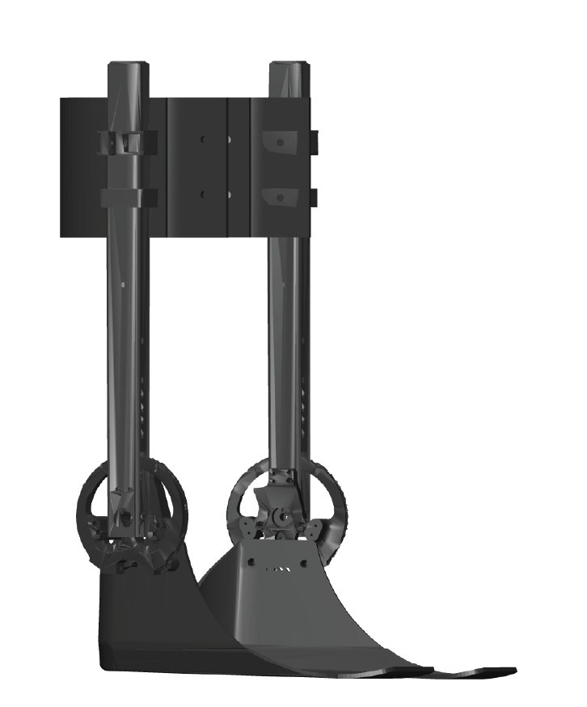
    </div>
    <div class="device-meta">
      <h3><code>OpenExo_L1</code> </h3>
      <p class="device-type">Ankle exoskeleton</p>
      <p>Bilateral ankle exoskeleton (OpenExo).</p>
    </div>
  </div>
  <div class="device-card">
    <div class="device-imgwrap">
      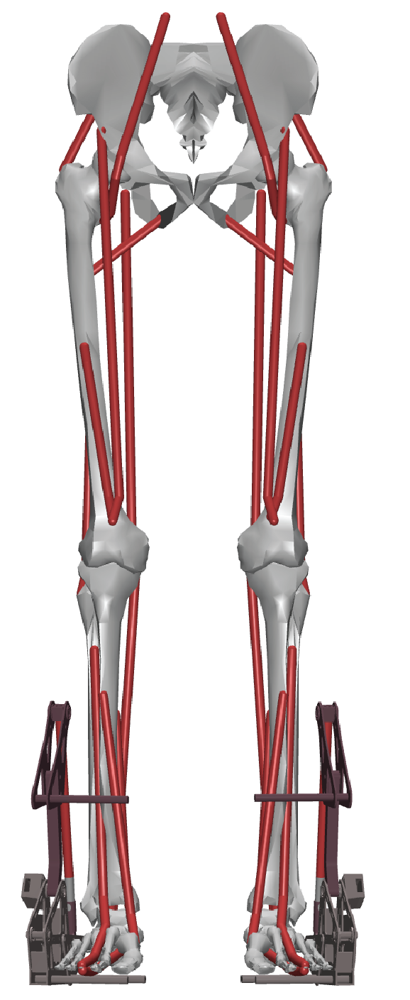
      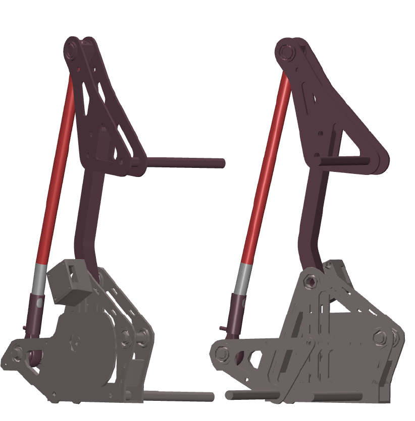
    </div>
    <div class="device-meta">
      <h3><code>UTAnkleExo_L2</code> </h3>
      <p class="device-type">Parallel-linkage ankle exo</p>
      <p>Bilateral parallel-linkage ankle exoskeleton.</p>
    </div>
  </div>
  <div class="device-card">
    <div class="device-imgwrap">
      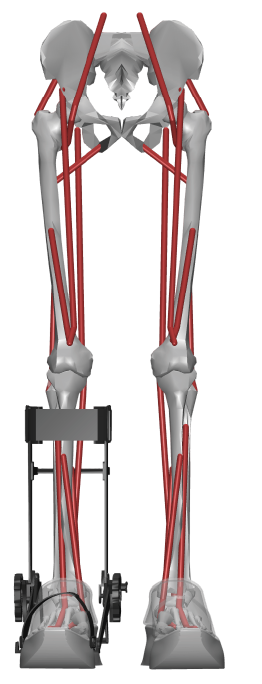
      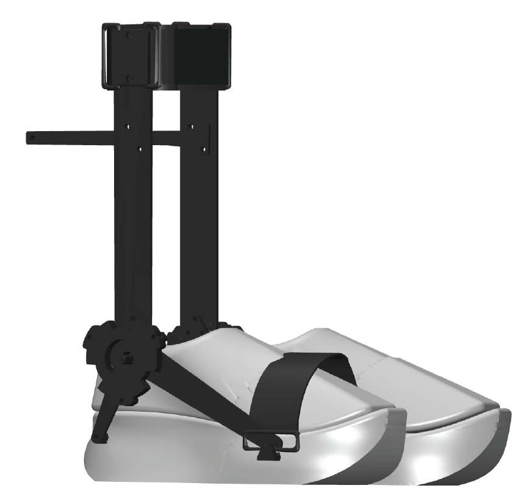
    </div>
    <div class="device-meta">
      <h3><code>Anatomics_L1</code> </h3>
      <p class="device-type">Ankle exoskeleton</p>
      <p>Bilateral instrumented soles with a passive right shank and foot frame.</p>
    </div>
  </div>
  <div class="device-card">
    <div class="device-imgwrap">
      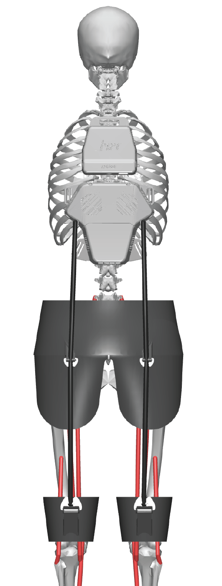
      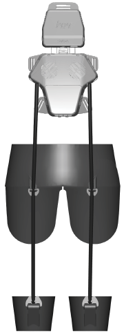
    </div>
    <div class="device-meta">
      <h3><code>HMEDI_L1</code> </h3>
      <p class="device-type">Hip-flexion cable exo</p>
      <p>Bilateral hip-flexion cable exoskeleton with a torso piece.</p>
    </div>
  </div>
  <div class="device-card">
    <div class="device-imgwrap">
      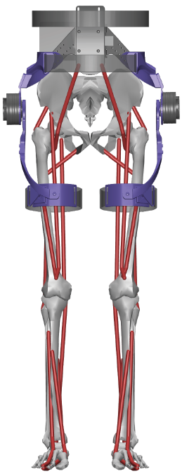
      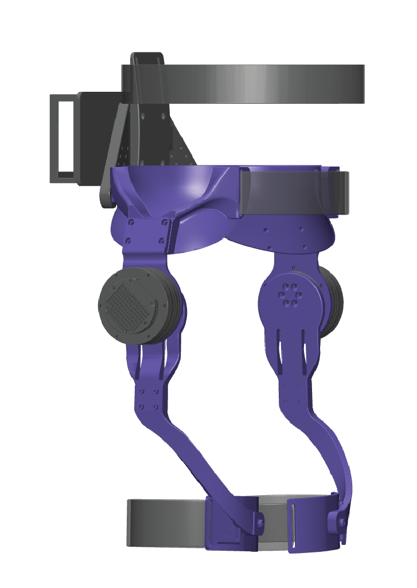
    </div>
    <div class="device-meta">
      <h3><code>Hippo_L1</code> </h3>
      <p class="device-type">Hip-flexion exoskeleton</p>
      <p>Bilateral hip-flexion exoskeleton with fixed-gain hip actuators.</p>
    </div>
  </div>
</div>

`Tutorial_L1` is a stripped-down teaching device for onboarding and baselines (no
render). `OSL_A` and `OSL_KA` are registered aliases for the OpenSourceLeg keys.

## Upper-body and seated-mobility environments

These environments cover assistance above the legs and seated mobility. They are built
by dedicated functions in `assist_sim/upper_body.py`, not the modular MSK × device
pipeline, so they do not appear in `python -m assist_sim list`.

<div class="device-grid">
  <div class="device-card">
    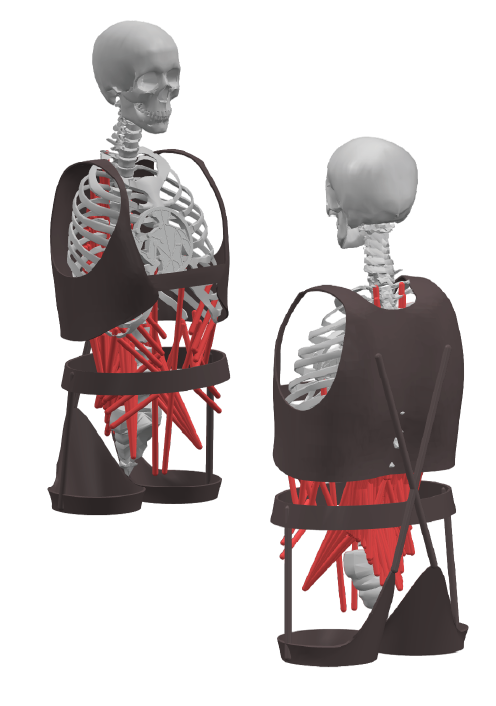
    <div class="device-meta">
      <h3><code>AuxivoLiftsuit</code> </h3>
      <p class="device-type">Back exosuit</p>
      <p>A passive back exosuit on the muscled <code>myotorso</code>.</p>
    </div>
  </div>
  <div class="device-card">
    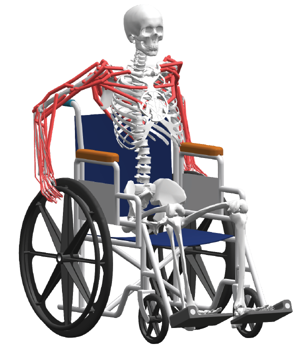
    <div class="device-meta">
      <h3><code>Wheelchair</code></h3>
      <p class="device-type">Seated mobility</p>
      <p>A seated human propelling a manual wheelchair.</p>
    </div>
  </div>
  <div class="device-card">
    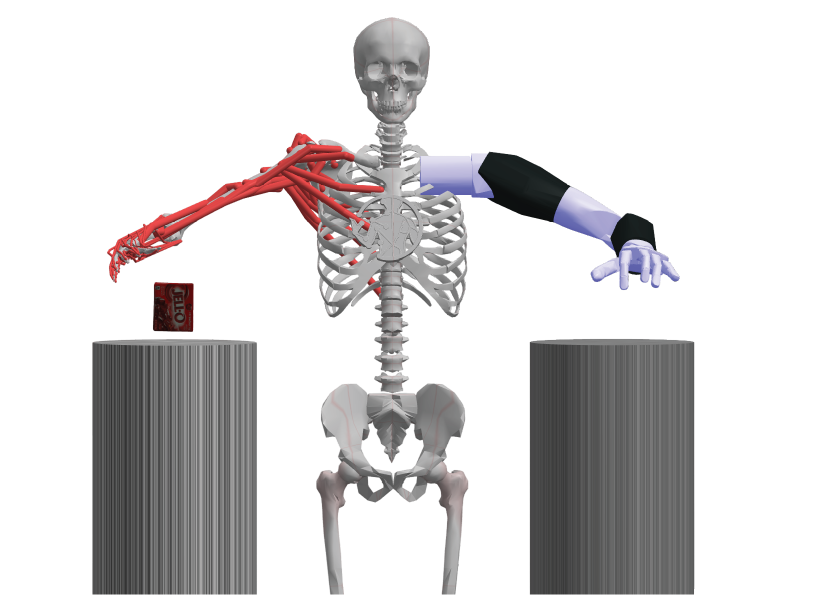
    <div class="device-meta">
      <h3><code>MPL</code> </h3>
      <p class="device-type">Bimanual prosthetic</p>
      <p>A bimanual Modular Prosthetic Limb robot. It also drives the bionic-bimanual manipulation task.</p>
    </div>
  </div>
</div>

`Wheelchair`, `AuxivoLiftsuit`, and the bionic-bimanual task also expose a
`build_*_spec()` companion that returns the uncompiled `MjSpec`.
`export_upper_body_xml(spec, path)` writes it to a standalone, reloadable XML.

## Listing combinations

```bash
python -m assist_sim list
```

This returns the live `{msk: [device, ...]}` map, showing only the MSK models that
resolve in the installed `myo_sim`.

```python
from assist_sim import get_available_combinations
print(get_available_combinations())
```
