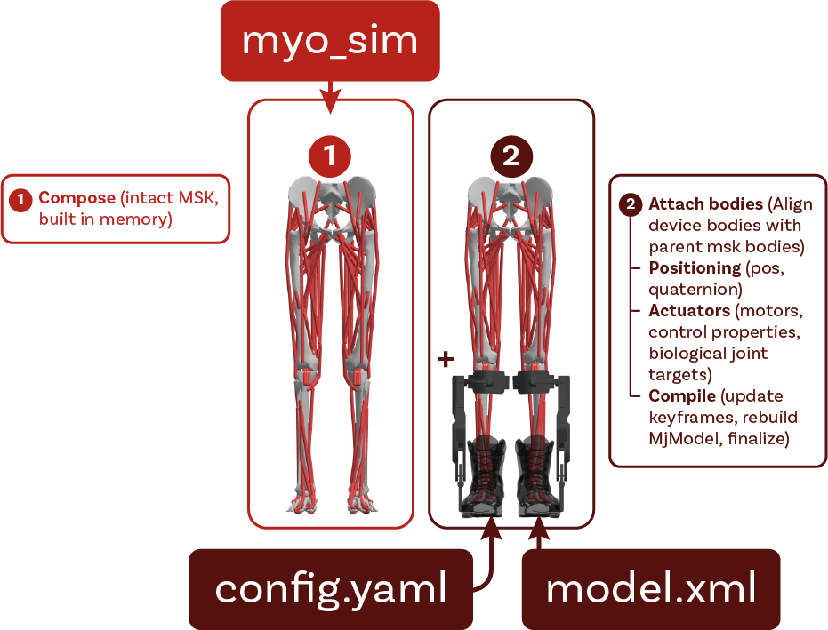
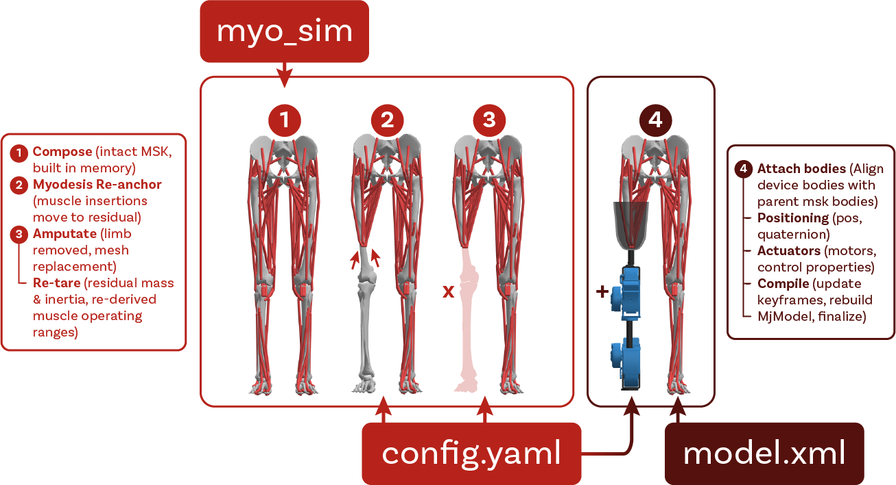

# Device Configuration

Every device has a YAML config under `models/<DeviceDir>/` (for example
`L1config.yaml`). The config tells `assist_sim` how to attach the device XML to a
human MSK and how to edit the combined model. This page covers the common sections.
For the full field-by-field reference and the deeper authoring notes, see the
[assist_sim config reference](https://github.com/neumovelab/assist_sim/blob/main/docs/device-config-reference.md).

## Top-level shape

```yaml
device:                  # required: name, model_xml, optional compatible_msk
attachments:             # required: map device bodies to MSK parent bodies

# optional sections, each defaults to empty:
equality:                # constraints tying a device body to the MSK
joint_overrides:         # change range/damping of existing MSK joints
actuators:               # add joint-transmission actuators
keyframe_overrides:      # patch joint values in existing keyframes, by name
body_removals:           # delete biological subtrees (prosthetics)
mesh_replacements:       # swap a geom's mesh
geom_removals:           # remove named geoms
body_overrides:          # override a body's mass / inertia
actuator_overrides:      # set a re-anchored muscle's lengthrange
actuator_removals:       # remove named actuators
tendon_removals:         # remove named tendons
tendon_modifications:    # re-anchor muscle wraps onto residual bone (myodesis)
contact:                 # add contact pairs / excludes
sensors:                 # add sensors
sensor_removals:         # remove sensors
```

Only `device` and `attachments` are *required*.

## `device`

```yaml
device:
  name: "DephyExoBoot_L1"
  model_xml: "L1model.xml"
  # compatible_msk: ["myolegs22", "myolegs26"]   # optional; the shipped
  # DephyExoBoot omits this field, so it composes with every MSK model.
```

| Field | Required | Meaning |
|-------|----------|---------|
| `name` | yes | Namespace prefix added to every body, site, mesh, joint, actuator, and tendon imported from the device XML. Convention: PascalCase plus an `_L1` suffix. |
| `model_xml` | yes | Path to the device MuJoCo XML, relative to this YAML file. |
| `compatible_msk` | no | Restrict which MSK models this device combines with. If absent, the device is compatible with all. |

## `attachments`

`attachments` maps each top-level device body to a parent body in the MSK.

```yaml
attachments:
  - device_body: "exo_1_r"
    parent_body: "tibia_r"
  - device_body: "fanny_pack"
    parent_body: "pelvis"
    pos: [0.0, 0.05, 0.0]      # optional frame offset
    quat: [1, 0, 0, 0]         # optional frame rotation
```

Each attachment re-parents the device body under the MSK body. Use `pos` and `quat`
to adjust the frame per attach point.

**Free-rooted devices.** A device that is a separate mechanism strapped to the leg
(for example a parallel linkage clamped at several points) attaches to `parent_body:
world` instead. The device body keeps its own `<freejoint>`, and `equality`
constraints then tie it to the leg.

<div style="text-align: center;">
  
</div>

## Optional sections

| Section | Purpose |
|---------|---------|
| `equality` | Add MuJoCo constraints (`connect`, `weld`, or `joint`) that tie a device body to an MSK body. Used to fasten free-rooted devices and to close kinematic loops. |
| `joint_overrides` | Change the range, damping, axis, or position of existing MSK joints. |
| `actuators` | Add joint-transmission actuators to the combined model. Tendon-transmission actuators are authored in the device XML instead. |
| `keyframe_overrides` | Patch joint values in the MSK's existing keyframes. Refers to joints by name, so it is model-agnostic. |
| `body_removals` | Delete biological body subtrees before attaching the device (for example remove `tibia_r` and below for a transfemoral amputation). Re-anchor any kept muscle first with `tendon_modifications`. |
| `tendon_modifications` | Re-anchor a kept muscle onto the bone that remains (the myodesis step): move its wrap sites and geoms onto the residual bone. This runs before the removals, or the cascade removes the muscle. |
| `actuator_overrides` | Set a re-anchored muscle's `lengthrange`. A re-anchor changes the muscle's operating range. |
| `mesh_replacements` / `geom_removals` | Swap a geom's mesh for one from the device XML, or remove a named geom (for example the residual stump mesh). |
| `body_overrides` | Override a body's `mass`, its inertia (`diaginertia`, or `fullinertia` as the len-6 form), and its inertial frame (`ipos`, `iquat`). Used to reduce a residual limb after an amputation, so the stump does not carry the whole segment's mass. |
| `actuator_removals` / `tendon_removals` | Remove named actuators or tendons (for example muscles that cross an amputation level). |
| `contact` | Add contact pairs and excludes to the combined model. |
| `sensors` / `sensor_removals` | Add or remove sensors (for example restore a foot touch sensor onto a prosthetic sole). |

The `sensors` section is not limited to `touch`. It also supports the other MuJoCo
sensor types, for example `jointlimitfrc`, `framepos`, and `force`. Each entry
names one target with the matching key (`site`, `joint`, `actuator`, `tendon`,
`body`, or `geom`). The
[assist_sim config reference](https://github.com/neumovelab/assist_sim/blob/main/docs/device-config-reference.md)
lists every type and the target each one needs.

## Prosthetic amputation workflow

A prosthetic device removes distal anatomy and keeps the muscles that remain. The order
matters:

1. `tendon_modifications`: re-anchor each kept muscle's wraps onto the residual bone.
2. `body_removals`: remove the distal bones. The cascade removes any muscle still
   anchored past the cut.
3. `actuator_overrides`: give each re-anchored muscle a new `lengthrange`.
4. `mesh_replacements` and `body_overrides`: swap in the residual stump mesh and reduce
   its mass.

<div style="text-align: center;">
  
</div>

## Per-MSK overrides

One config can carry per-MSK variations. A section holds a `default` entry plus
per-MSK-key entries, and the resolver picks the matching MSK key if present:

```yaml
attachments:
  default:
    - device_body: "hmedi_torso"
      parent_body: "torso"
  myolegs:
    - device_body: "hmedi_torso"
      parent_body: "pelvis"
      pos: [-0.105, 0.08, 0]
```

Every section except `actuators` and the legacy `keyframes` supports this form. The
[assist_sim config reference](https://github.com/neumovelab/assist_sim/blob/main/docs/device-config-reference.md)
gives the full field detail and authoring rules for each section.

---

## Upper-body & Seated-mobility environments {#upper-body}

The upper-body and seated-mobility environments are the non-gait members of the
device set. See the three cards at the bottom of the [Device Catalog](catalog).

These environments differ from the [gait-assistive devices](catalog). They are
**not registry devices**, and are less modular. A dedicated builder
function in `assist_sim.upper_body` makes each one. You do not use
`load_combined`. The `MPL` is the prosthetic device, not a host model. The
standalone `MPL` environment loads it on its own, with no `myo_sim` human. In the
bionic-bimanual task, the `MPL` device mounts on a `MyoArm` host. The `Wheelchair`
environment composes a `MyoArm` on a rigid or muscle-driven `MyoTorso`.
`build_wheelchair` uses bimanual arms (`both`) by default, and also accepts
`left` or `right`.

| | Gait-assistive devices | Upper-body & seated-mobility |
|---|---|---|
| Shape | Modular MSK × device composition | Single composed model per environment |
| Entry point | `load_combined("<msk>", "<device>")` | `build_<env>(...)` in `assist_sim.upper_body` |
| Discovery | Found in the registry; `list` shows them | Not registry devices; `list` does not show them |
| MSK choice | Any compatible registry MSK model | The builder composes the human, if there is one |
| Configuration | Device YAML plus per-MSK overrides | Builder keyword arguments (for example `arms=`, `torso=`) |
| Output | `(MjModel, MjData)` | `(MjModel, MjData)` |

### The build API

Each environment has a builder in `assist_sim.upper_body`. The builder returns a
compiled model and a new `MjData`:

```python
from assist_sim.upper_body import (
    build_wheelchair,
    build_mpl,
    build_auxivo_liftsuit,
    build_bionic_bimanual,
)

model, data = build_wheelchair(arms="both", torso="passive")  # "both"|"right"|"left"; "passive"|"muscled"
model, data = build_mpl()               # standalone bimanual MPL robot (no myo_sim human)
model, data = build_auxivo_liftsuit()   # passive back-exosuit on the muscled myotorso
model, data = build_bionic_bimanual()   # biological arm + MPL prosthesis manipulation task
```

Every builder returns `(mujoco.MjModel, mujoco.MjData)`. This is a standard
compiled MuJoCo model with data at `qpos0`. You can step it or render it at once.

The three **composed** environments also give a `build_*_spec(...)` companion:
`build_wheelchair_spec`, `build_auxivo_liftsuit_spec`, and
`build_bionic_bimanual_spec`. The companion returns the uncompiled `MjSpec`. Use
it to compose more elements, or to export the environment (see
[Exporting & Loading Models](exporting-and-loading#upper-body-environments)).
`build_mpl` has **no** spec companion, because `assist_sim` loads the MPL directly
from its XML file.

### Common properties

The three composed environments (Wheelchair, AuxivoLiftsuit, bionic-bimanual)
share the same conventions. **MPL is the exception**, as it is a self-contained
environment with no `myo_sim` msk, and `assist_sim` loads it directly.

- **The human comes from `myo_sim`.** `assist_sim` composes the anatomical body
  from `myo_sim` at build time. It does not hold the anatomical meshes.
- **Device hardware meshes only.** The hardware meshes for each environment
  (chair frame, exosuit shell, prosthetic parts, task object) are in
  `models/<Name>/`. MPL is a robot, so it holds its full mesh set.
- **Rigid parts have no joints.** Some parts do not need a degree of freedom, such
  as the seated legs of the Wheelchair. The builder writes the pose into the body
  geometry and removes the joints.
- **Transcribed keyframes.** If the original environment supplied keyframes, the
  builder maps them by joint name onto this build. The Wheelchair has two
  propulsion poses. bionic-bimanual has four task poses. MPL and AuxivoLiftsuit
  have none.
- **Model-only output.** The composed model holds the human and the device. A
  downstream step adds the scene and the terrain, the same as for the
  gait-assistive devices. MPL is the exception, because it carries its own basic
  scene.

### The environments

#### AuxivoLiftsuit

A passive back-exosuit in the style of the Auxivo Liftsuit. The human wears it over
the **muscled** `myotorso`, which has spine joints and trunk muscles.
`build_auxivo_liftsuit()` attaches the exosuit hardware to the torso, then couples
it with two body welds and four spring tendons. This environment supplies no
keyframes.

```python
from assist_sim.upper_body import build_auxivo_liftsuit

model, data = build_auxivo_liftsuit()
```

#### Wheelchair

A seated human who propels a manual wheelchair.
`build_wheelchair(arms="both", torso="passive")` composes the selected arms on the
selected torso, sets the legs to a rigid seated pose, and fixes the chair hardware
to the torso.

```python
from assist_sim.upper_body import build_wheelchair

model, data = build_wheelchair(arms="both", torso="passive")
```

- **`arms`**: `"both"` (mirrored bimanual), `"right"`, or `"left"`. The original
  model has a single right arm, which is `arms="right"`.
- **`torso`**: `"passive"` or `"muscled"`. The default is `"passive"`, a locked
  scaffold with no muscles. `"muscled"` is the active `myotorso` with spine joints
  and trunk muscles.
- The **legs** are rigid and have no joints. Only the arms articulate.
- The **keyframes** `start_return` and `pushing` drive the propulsion cycle.

#### MPL

The **Modular Prosthetic Limb** (JHU/APL) is a self-contained robotic bimanual arm
and hand model. It has its own meshes and actuators, and it has **no `myo_sim`
human**. It comes as the bimanual "SALLY" configuration: a torso with two MPL arms
and simplified hands. `build_mpl()` **loads it directly** and does not compose it.
MPL carries its own basic scene (floor, skybox, lights) and supplies no keyframes.

```python
from assist_sim.upper_body import build_mpl

model, data = build_mpl()
```

#### bionic-bimanual

The "bionic bimanual" manipulation task. A biological **right** arm faces an MPL
**left** prosthetic arm. Between them is a YCB gelatin box on a `start` pillar, and
the task moves it to a `goal` pillar. `build_bionic_bimanual()` composes the human
as a passive torso with a right arm, then attaches the prosthesis, the object, the
pillars, and the base pedestal. It supplies four task keyframes.

```python
from assist_sim.upper_body import build_bionic_bimanual

model, data = build_bionic_bimanual()
```

### Exporting

To write a composed environment to a standalone XML file, pass the output of the
`build_*_spec(...)` companion to `export_upper_body_xml`. See
[Exporting & Loading Models](exporting-and-loading#upper-body-environments) for the
full procedure. `build_mpl` has no export path, because the MPL is already a
standalone XML file on disk.
