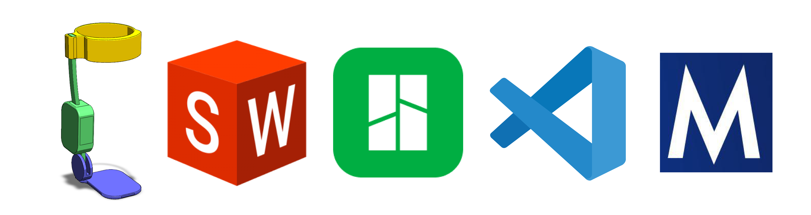
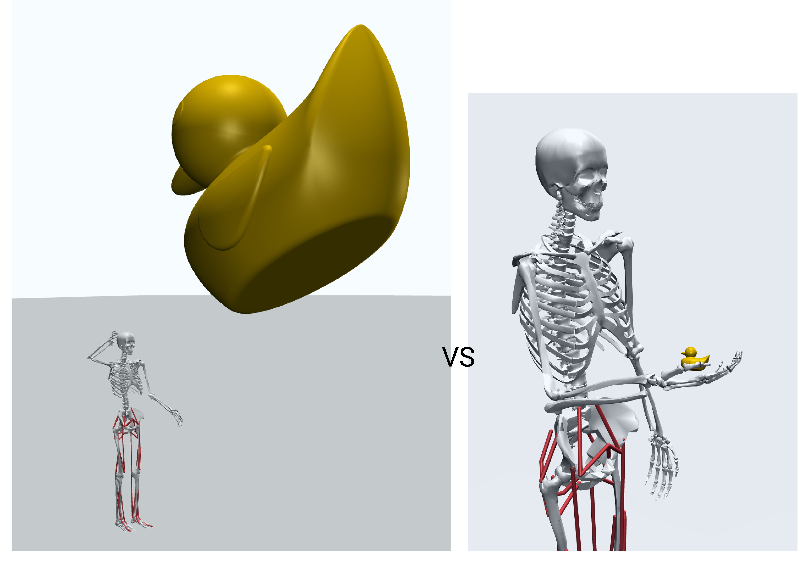
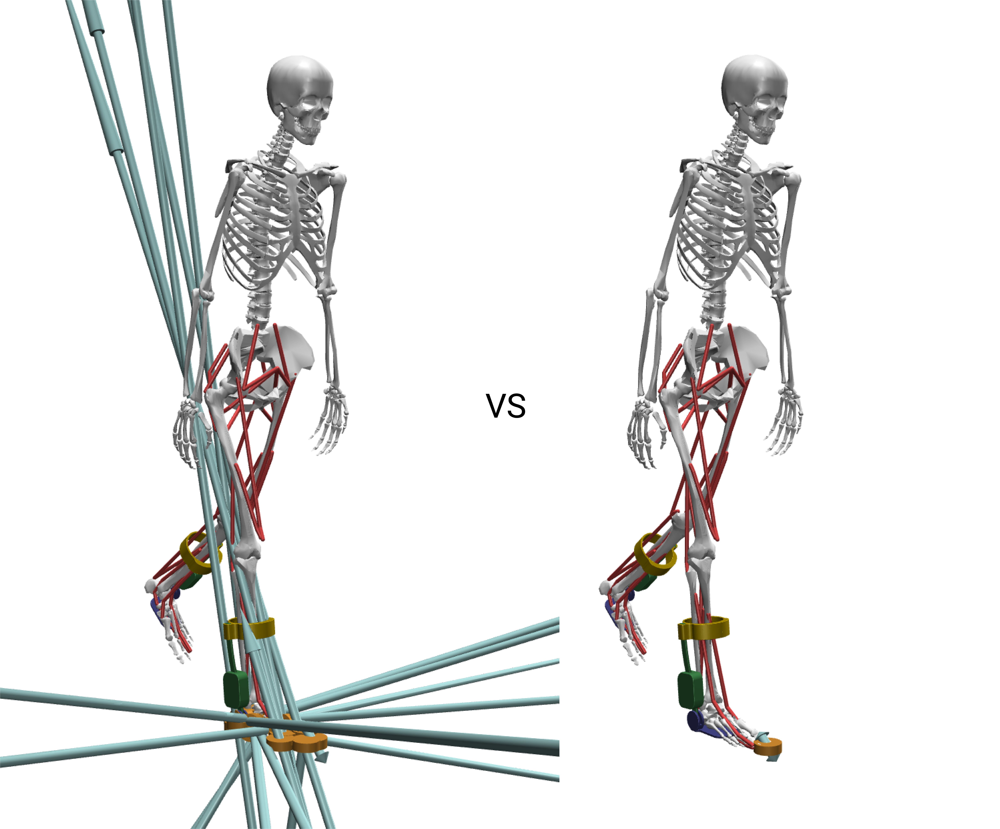

# Modeling Tips

This page collects practical tips for preparing a device mesh set and inspecting
the result. It supports [Add a Device](add-a-device), which covers the device XML
and the YAML config. For assembly-to-MJCF utilities that are under development, see
the [modeling-tools repository](https://github.com/cnrobbins/modeling-tools). For
the MuJoCo XML format, see the
[MuJoCo documentation](https://mujoco.readthedocs.io/en/stable/XMLreference.html).

## What you need

- **A 3D model of your device.** The mechanism you want to simulate.
- **CAD software.** A program of your choice, such as SolidWorks or Fusion 360.
- **A slicer (optional).** A slicer such as Bambu Studio or PrusaSlicer helps with
  quick transforms of `.stl` files.
- **An XML editor.** A text editor or IDE, such as VS Code.
- **The MuJoCo visualizer.** The standalone `simulate` tool from the
  [MuJoCo releases](https://github.com/google-deepmind/mujoco/releases).

## Prepare the meshes

### Simplify the meshes

Group the connected parts of your device that do not move relative to each other.
Export each such group as a single `.stl` file. This reduces the number of
components that you import, define, and position, and it keeps the model accurate.

### Check the reference frames

Confirm the origin and the axes of each component in your CAD software before you
export. A correct frame at export time saves a lot of adjustment later. A slicer is
useful for quick translations and rotations of an `.stl` file.

### Scale to model units

The `myo_sim` models use **meters**. CAD software often exports in millimeters. If
your device is in millimeters, scale it by `0.001` to convert it to meters. A
device at the wrong scale looks far too large or far too small when it attaches.

The pipeline reads the `pos` and `quat` of each device body in the frame of its
**parent** MSK body, not in the world frame. So orient each mesh to sit correctly
against its attachment body, then fine-tune the placement with `pos` and `quat` on
the attachment. See [Add a Device](add-a-device#step-4-compile-and-examine-the-model).
The figure below shows a part defined at world scale (left) against the same part
scaled and placed in the model frame on the model's hand (right).

<i>Defined in the world frame in mm, versus in the body frame in m.</i>

## Inspect in the MuJoCo visualizer

The visualizer is your primary tool for inspecting and debugging a model.

**Reset to a keyframe first.** When you load or reload a model, reset it to a
keyframe pose with the `Simulation -> Key` menu. The pose at load time is not the
intended pose.

### Useful menus

- **Simulation -> Reset**: reset the model to a selected keyframe pose.
- **Simulation -> Reload**: reload the XML file to reflect saved changes.
- **Simulation -> Run/Pause**: toggle the physics. Pause it while you edit.
- **Simulation -> Copy Pose**: copy the current `qpos` and `qvel` to the clipboard.
  This is useful for updating a keyframe after you pose the model.
- **Rendering -> Inertia**: render the inertial box for every body.
- **Rendering -> Contact Point / Contact Force**: show contact locations and
  forces.
- **Rendering -> Static Body**: hide or show non-moving bodies, such as the ground.
- **Rendering -> Group Enable**: toggle the visibility of geom and site groups. The
  foot and toe touch-sensor sites are in `Site groups -> "Site 3"`.

### Viewer hotkeys

- **Space**: play or pause the simulation.
- **+ / -**: speed up or slow down.
- **Left / Right arrow**: step back or forward.
- **[ ]**: cycle the camera.
- **Esc**: free camera.
- **F1**: help. **F2**: info. **F5**: full screen.
- **Scroll or middle drag**: zoom. **Left drag**: orbit. **Shift + right drag**:
  pan.
- **Double-click**: select. **Page Up**: select the parent body.
- **Ctrl + drag**: rotate the selected object. **Ctrl + right drag**: translate it.

## Check contacts and sensors

Verify how the model touches its environment. Use the `Contact Point` and
`Contact Force` render options for this.

- **Self-contact.** If the model collides with itself, add a `contact` entry to the
  device config to exclude the collision between specific geoms. See
  [Device Configuration](device-configuration).
- **Unexpected forces.** If the model generates surprising forces, adjust the pose.
  A `pelvis_ty` that is too low pushes the model into the terrain and creates large
  contacts.
- **Devices on the feet.** A shoe or a foot device changes the ground clearance. Set
  the model's initial height (`pelvis_ty`) with a `keyframe_overrides` entry so the
  model does not start inside the terrain. Reposition the foot touch sensors
  (`r_foot_touch`, `r_toes_touch`) to match the new geometry with a `sensors` entry.

<i>Incorrect contacts and forces, versus corrected contacts and forces.</i>

## See also

- [Add a Device](add-a-device): the device XML and the YAML config.
- [Device Configuration](device-configuration): the config sections for contacts,
  sensors, and keyframes.
- [modeling-tools repository](https://github.com/cnrobbins/modeling-tools):
  assembly-to-MJCF utilities under development.
