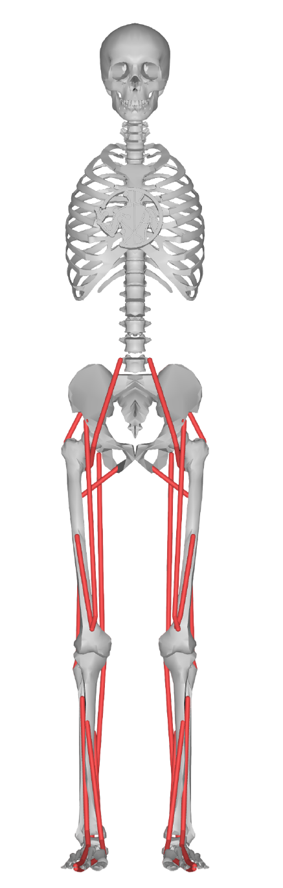
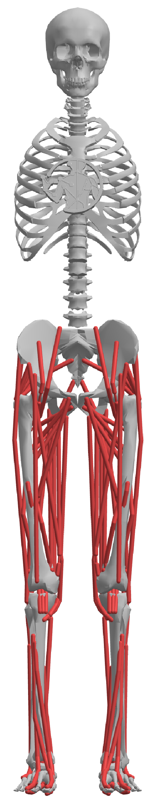
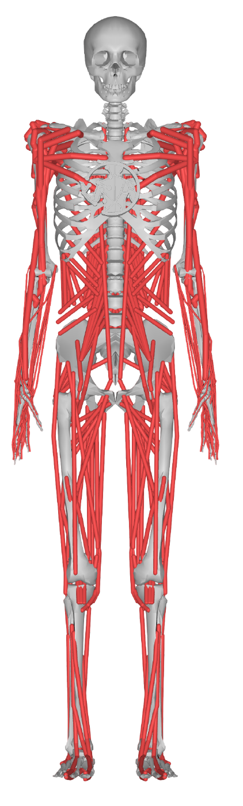

# MSK Models

The human musculoskeletal (MSK) model is the `msk` of an
[environment spec](../getting-started/defining-an-environment). MSK models come from
[`myo_sim`](https://github.com/MyoHub/myo_sim). `myo_sim` composes each leg model at
runtime, so an MSK key resolves by a call to `myo_sim.build_spec(<model>)`. The
`assist_sim` key matches the `myo_sim` model name.

| Key | Base nq | Description |
|-----|---------|-------------|
| `myolegs26` | 47 | 26-muscle, passive torso and legs. |
| `myolegs22` | 39 | Planar 22-muscle. A sagittal-plane reduction of `myolegs26`. |
| `myolegs` | 35 | 80-muscle, passive torso. |
| `myofullbody` | 129 | Full body: torso muscles, arms, and legs. |

`myolegs`, `myofullbody`, and `myolegs22` require `mujoco>=3.3.4`. `myolegs26` builds
on `3.3.3`. An unknown key raises a clear error rather than a silent fallback.

The muscle count and the 2D or 3D control mode come from the `msk` key. You do not set
them separately.

Only `myolegs22` ships keyframes. The other three models load at `qpos0`, so a device
config's `keyframe_overrides` has no effect on them.

## myolegs26

`myolegs26` is the base 3D model: 26-muscle legs under a passive anatomical torso.

- **Torso.** A passive torso scaffold (spine, ribs, head; no arms, no torso muscles)
  sits over the legs. Torso-targeting devices, such as HMEDI's torso band, work on it.
- **Free-root base.** The root is a `freejoint` on the torso scaffold, not
  `pelvis_tx`/`pelvis_ty` slide joints. Device keyframe overrides that target
  `pelvis_ty` are skipped, because that joint does not exist.
- **No keyframe.** The model loads at `qpos0`, the assembled standing pose. It loads
  floating slightly above the ground; there is no `stand` keyframe.

### myolegs22 (planar reduction)

`myolegs22` is a planar, sagittal-plane reduction of `myolegs26`. It is the model used
for most reflex Controller Optimization work.

- **Planar root.** The root is three sagittal-plane DOFs: `pelvis_tx` (fore-aft),
  `pelvis_ty` (vertical), and `pelvis_tilt`. Device keyframe overrides that target
  `pelvis_ty` therefore apply.
- **Reduced from 26.** The frontal-plane hip DOFs (`hip_adduction`, `hip_rotation`)
  and the `abd`/`add` muscles are removed to go from 26 to 22 muscles. The torso is
  kept.
- **Keyframes.** It ships five keyframes that survive device combination: `stand`,
  `walk_left`, `walk_right`, `squat`, and `lunge`.

## myolegs (80-muscle)

`myolegs` is the 80-muscle lower-limb model: the highest muscle fidelity for the legs,
over the same passive torso scaffold as `myolegs26`.

- **Torso.** Passive torso scaffold, so torso-targeting devices work on it.
- **Free-root base.** Like `myolegs26`, the root is a `freejoint`, and device keyframe
  overrides that target `pelvis_ty` are skipped.
- **No keyframe.** It loads at `qpos0`, floating slightly above the ground.
- Requires `mujoco>=3.3.4`.

## myofullbody (full body)

`myofullbody` is the most complete human model: torso muscles, arms, and legs (129 base
DOFs). Use it for whole-body studies, or when a device or task involves the trunk or
arms as well as the legs.

- Requires `mujoco>=3.3.4`.
- Every device also composes with it, because it shares the same torso attachment
  scaffold. See the [Device Catalog](devices/catalog).

See [Defining an Environment](../getting-started/defining-an-environment) for how to
pair an MSK with a device and a terrain.
