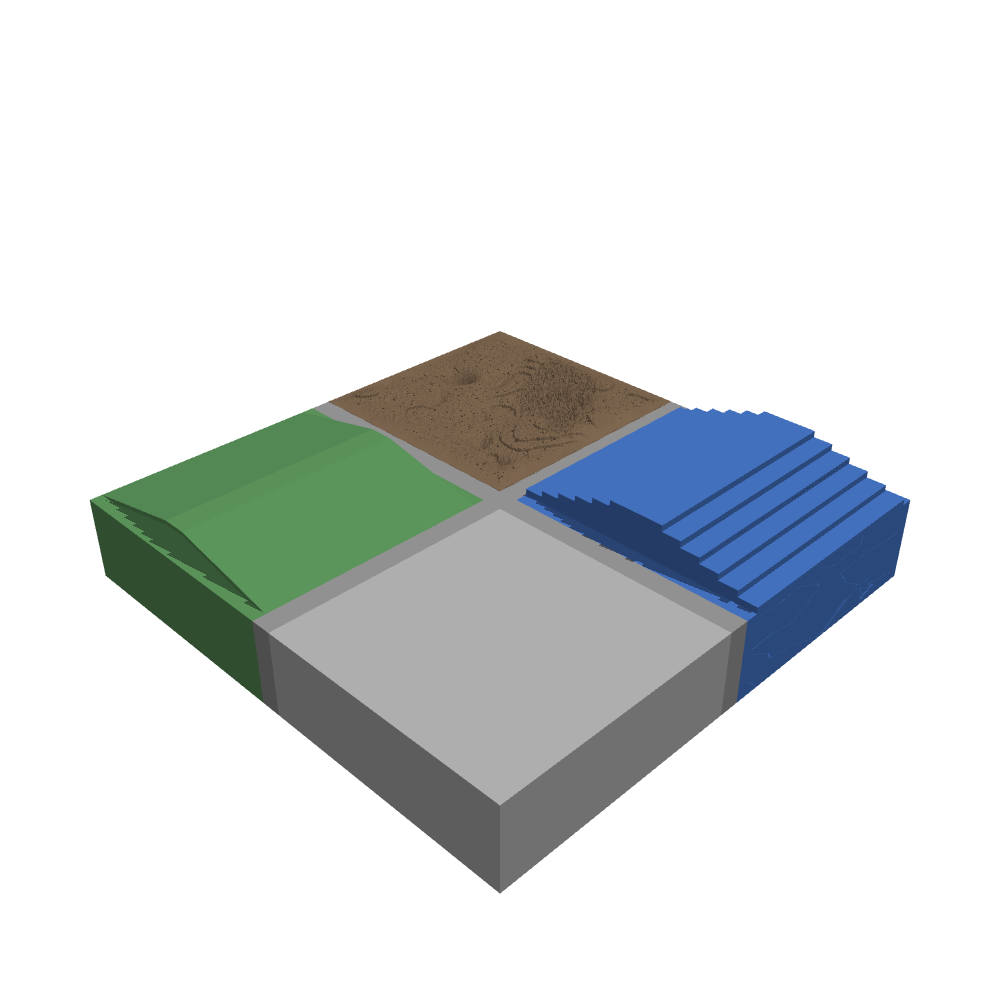

# Terrains

Terrain is the ground of an environment. It is produced by
[`myoassist.terrains`](https://github.com/neumovelab/myoassist.terrains) and set
through the `terrain` field of the [environment spec](../../getting-started/defining-an-environment).
A terrain is either one uniform surface (a plane or a single heightfield) or a
tiled grid of many terrain types.

This section covers the tiled-grid model. For the uniform surfaces and how to set
`terrain` in a CO or RL run, see
[Defining an Environment](../../getting-started/defining-an-environment).

  
  
<i>A tiled grid mixing flat, slope, rough, and stairs tiles, joined by connectors.</i>

## Grid

A terrain is a `rows × cols` grid of square or rectangular **tiles** with a
configurable `tile_size = (width_x, length_y)`. The grid is centered at the world
origin. Cell `(row=0, col=0)` is at the most-negative `(x, y)` corner. Rows increase
in `+y`, and columns increase in `+x`.

## Tiles

Each cell holds one **tile type** from the registry. A tile module supplies its
`DEFAULT_PARAMS`, its `PARAM_RANGES`, and an `emit(...)` function that adds geoms
(and, for `rough`, a heightfield asset) to a MuJoCo `MjSpec`. See
[Tile Types](tile-types) for the full catalog.

## Connectors

A flat connector strip of `border.width` meters separates the cells. Set the width
to `0` to make tiles touch. Edge connectors and corner pieces are generated
automatically. Their top face matches the neighboring tile heights through
`border.match_mode` (`"min"`, `"max"`, or `"mean"`). Connectors run down to
`BASELINE_Z = -2.0`, so a height difference reads as a clean step riser, not a
floating shelf.

## Boundary contract

Every tile presents a flat top at its declared base height around its whole
perimeter (the `flat-at-base` contract). This lets connectors join cleanly, whatever
happens in the middle of the tile.

## Palette

There are three palette modes, set by `palette_preset`:

| Mode | Behavior |
|------|----------|
| `diverse` | Each tile type renders in its own default color. Easy to read while you tune a config. |
| `uniform` | Every tile shares the color of `terrain_mat` from `terrain_style.xml`, plus an optional texture. Good for final renders. |
| `custom` | Like `diverse`, but with per-type rgba overrides in `palette`. |

In `uniform` mode you can bind a single 2D texture to the material through a
`texture` block, for a concrete, asphalt, or dirt finish.

## Randomization

The framework fills any cell that has no explicit `tiles` entry. It samples a tile
type from `randomization.weights`, then draws that tile's parameters from
`randomization.param_ranges[type]` or from the tile's built-in `PARAM_RANGES`.
Explicit `tiles` and `randomization` can coexist. Explicit placements win, and the
rest of the grid is sampled. See [Configuration](configuration) for the full schema.
