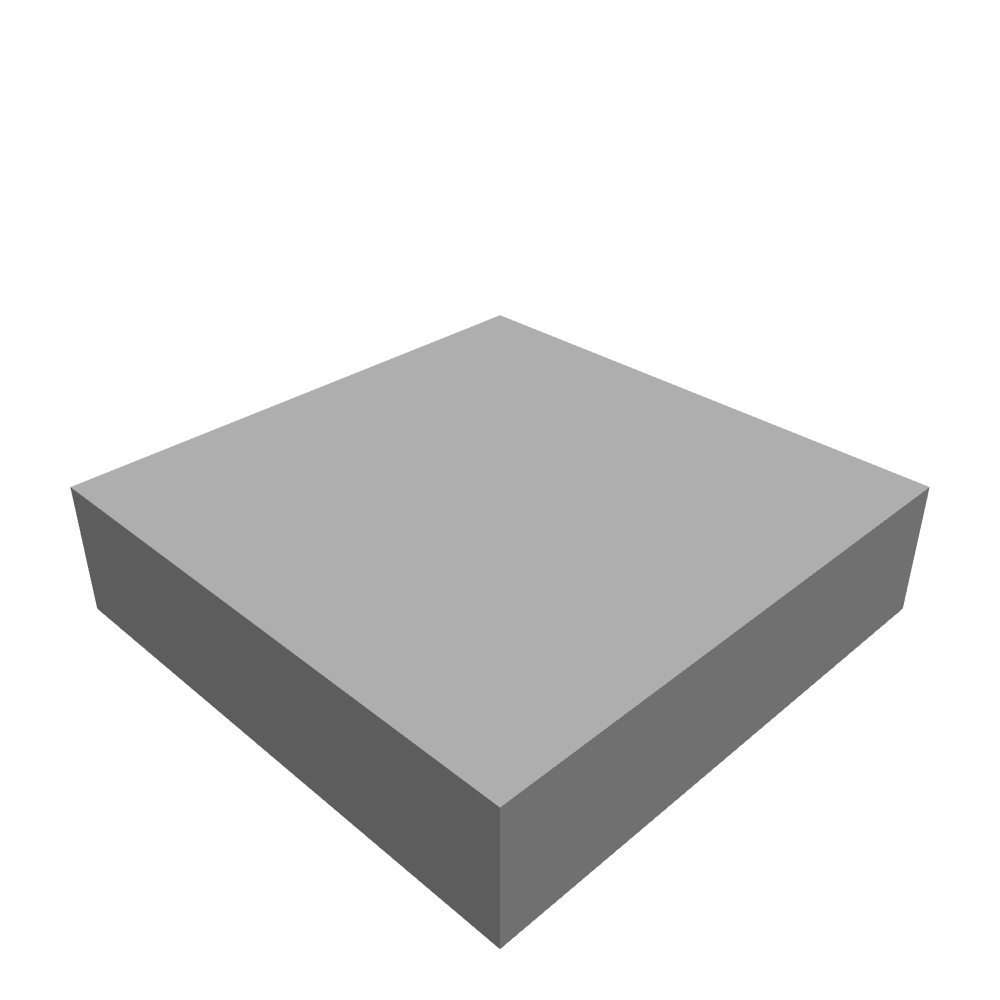
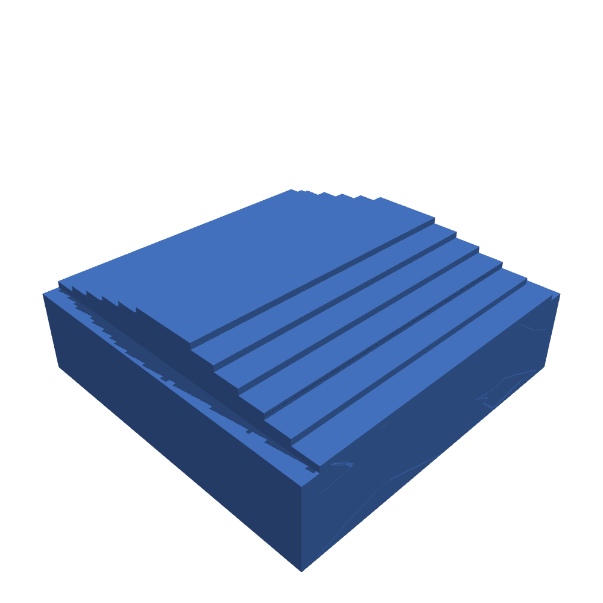
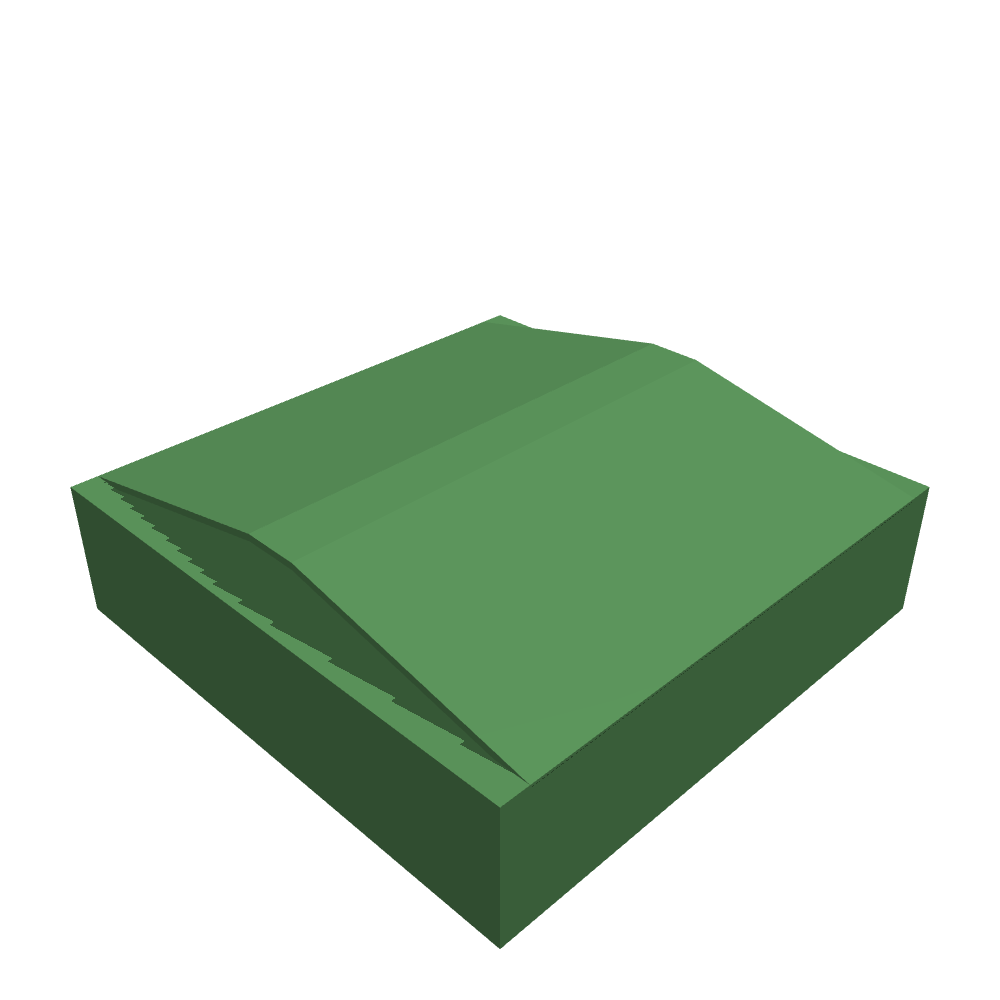
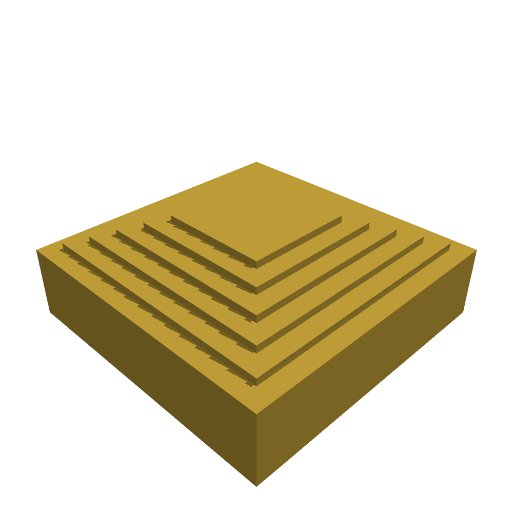
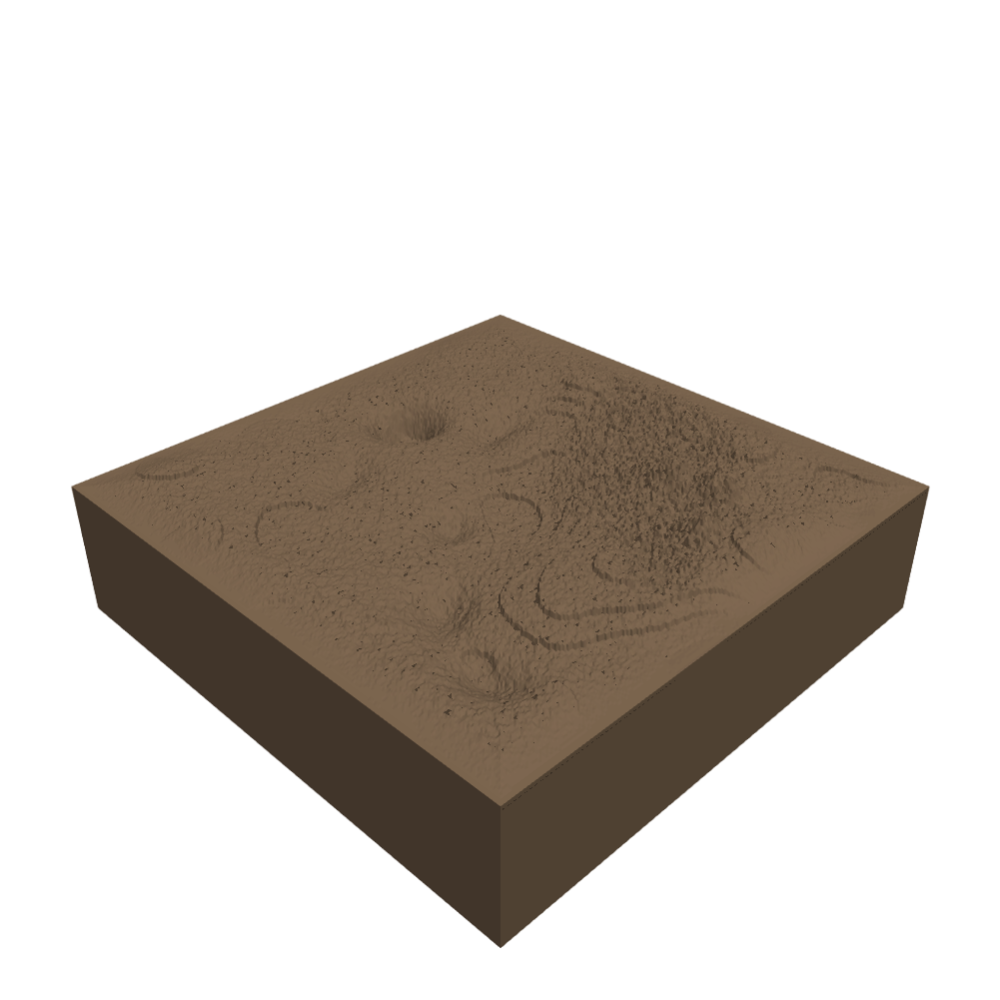
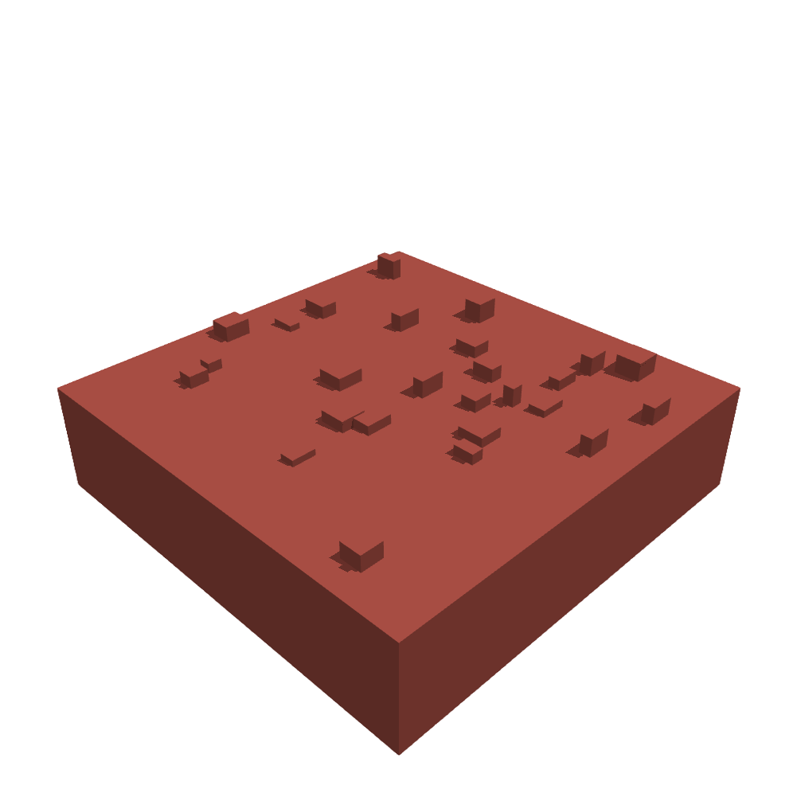
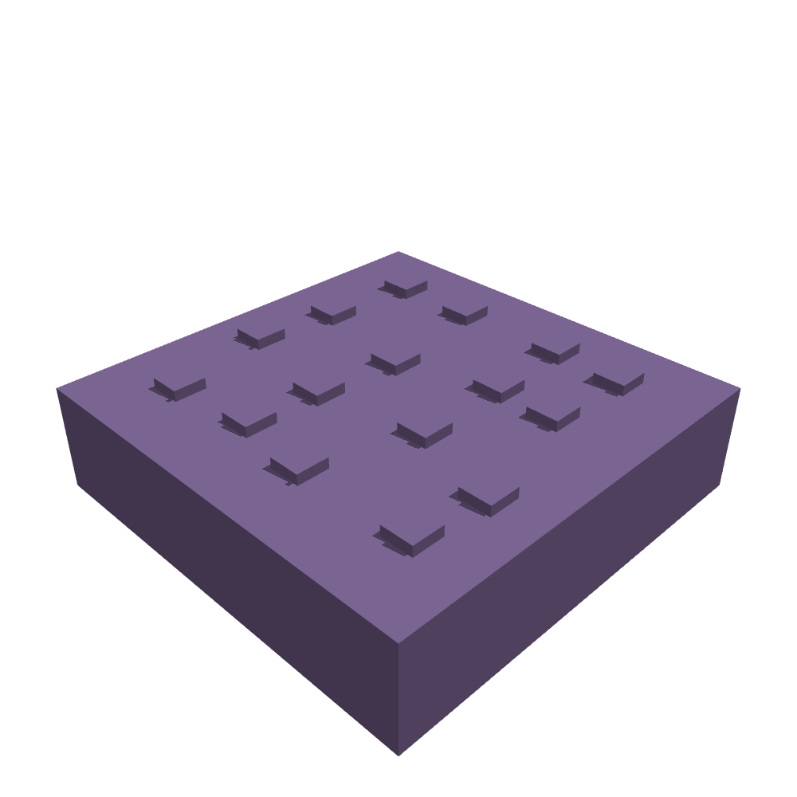
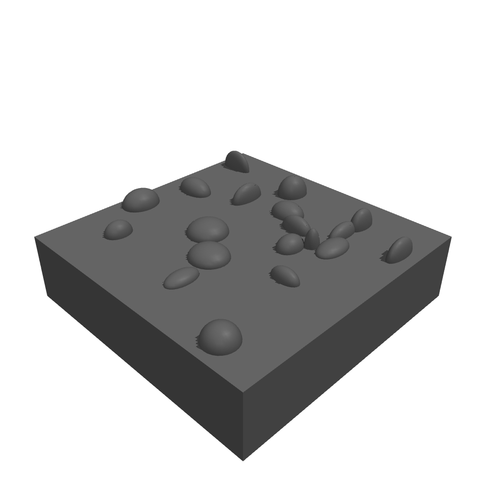
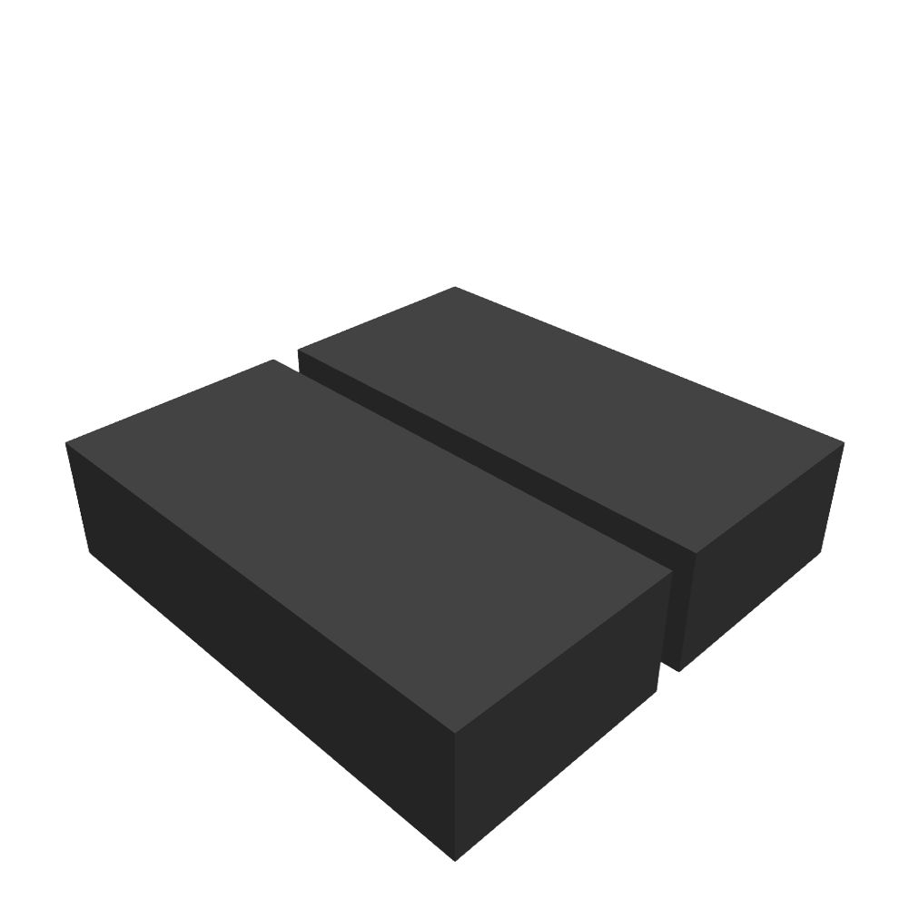

# Tile Types

These are the tile types you can place in a terrain `grid`. All sizes and heights are
in meters. Angles are in degrees, where a parameter name says so (`angle_deg`).

Every tile keeps a flat top at its `base_height` around its perimeter, so tiles join
cleanly. `gap` is the one exception: its trench mouth reaches the tile edge, which is
the point of the tile. The framework measures this contract for every tile, and for
every `inverted` variant, by ray-casting the compiled model.

Each tile also reports its own surface height, which is what the velocity map uses and
what [`surface_height_at`](configuration#asking-where-the-ground-is) answers.

## `flat`

A flat-topped box at a fixed height.

| Parameter | Default | Range / type | Description |
|-----------|---------|--------------|-------------|
| `height`  | `0.0`   | float        | Top face z-coordinate (offset above the grid plane). |

## `stairs`

A staircase that rises to a central peak, then mirrors down. It supports an <code>inverted</code> variant.

| Parameter | Default | Range / type | Description |
|-----------|---------|--------------|-------------|
| `step_height` | `0.15` | float, `(0.08, 0.25)` | Riser height per step. |
| `step_width` | `None` | float or `None` | Tread depth. `None` auto-fits all `n_steps`, leaving one tread of flat landing at each end of the tile. |
| `n_steps` | `6` | int, `(3, 12)` | Number of risers from base to peak. |
| `axis` | `"y"` | `"x"` or `"y"` | Axis the staircase progresses along, so you cross the steps travelling along it. |
| `peak_width` | `0.4` | float, `(0.2, 0.5)` | Width of the flat plateau at the top. |
| `return_mode` | `"mirror"` | str | How the descending half is built. |
| `cross_ratio` | `0.9` | float | Fraction of the perpendicular axis covered by tread. |
| `inverted` | `False` | bool | If `True`, stairs descend into a pit and mirror back up. |
| `base_height` | `0.0` | float | z-coordinate of the tile's flat-edge base. |

## `slope`

A flat ramp that climbs along one axis, with an optional plateau at the peak.

| Parameter | Default | Range / type | Description |
|-----------|---------|--------------|-------------|
| `angle_deg` | `12.0` | float, `(5.0, 25.0)` | Incline angle in degrees. |
| `axis` | `"y"` | `"x"` or `"y"` | Axis the slope rises along. |
| `direction` | `"mirror"` | str | How the falling half is built. |
| `plateau_ratio` | `0.1` | float, `(0.05, 0.3)` | Fraction of tile length given to the flat peak. |
| `cross_ratio` | `0.9` | float | Fraction of the perpendicular axis covered by the ramp. |
| `inverted` | `False` | bool | If `True`, the ramp descends into a pit and rises back. |
| `base_height` | `0.0` | float | z-coordinate of the tile's flat-edge base. |

## `pyramid_stairs`

Concentric square stairs that rise to (or descend from) a central platform.

| Parameter | Default | Range / type | Description |
|-----------|---------|--------------|-------------|
| `step_height` | `0.2` | float, `(0.1, 0.3)` | Riser height per step. |
| `step_width` | `0.5` | float, `(0.3, 0.8)` | Tread depth (radial). |
| `n_steps` | `5` | int, `(3, 8)` | Number of concentric steps. |
| `outer_margin` | `0.5` | float, `(0.2, 1.0)` | Flat band between the tile edge and the first step. |
| `inverted` | `False` | bool | If `True`, stairs descend into a central pit. |
| `base_height` | `0.0` | float | z-coordinate of the tile's flat-edge base. |

## `rough`

Heightfield-backed mixed terrain (basins, plateaus, hills, and detail noise). It writes a <code>.png</code> heightmap to the terrain library directory.

| Parameter | Default | Range / type | Description |
|-----------|---------|--------------|-------------|
| `seed` | `0` | int, `(0, 1e6)` | RNG seed for the heightmap. |
| `vertical_relief` | `0.8` | float, `(0.1, 1.5)` | Peak-to-trough excursion of the surface in meters. |
| `grid_resolution` | `256` | int | Heightmap resolution in pixels per side. |
| `num_pits` | `18` | int, `(0, 30)` | Number of gaussian pit features blended in. |
| `num_hills` | `24` | int, `(0, 30)` | Number of gaussian hill features blended in. |
| `terrace_levels` | `5` | int, `(1, 9)` | Plateau quantization levels. |
| `pit_threshold` | `0.33` | float | Selector cutoff that switches a macro region to a pit. |
| `plateau_threshold` | `0.68` | float | Selector cutoff that switches a macro region to a plateau. |
| `edge_taper_frac` | `0.1` | float | Fractional band over which the surface returns to `base_height` at the tile edge. |
| `relief_mode` | `"centered"` | `"centered"`, `"up"`, or `"down"` | Whether features go above and below the base, only up, or only down. |
| `base_height` | `0.0` | float | z-coordinate of the tile's flat-edge base. |

## `discrete_obstacles`

Randomly placed boxes at random heights.

| Parameter | Default | Range / type | Description |
|-----------|---------|--------------|-------------|
| `density` | `0.4` | float, `(0.1, 1.0)` | Obstacles per square meter. The count is `round(density * tile area)`. |
| `size_range` | `[0.2, 0.5]` | `[lo, hi]` | Min and max obstacle footprint size in meters. |
| `height_range` | `[0.1, 0.4]` | `[lo, hi]` | Min and max obstacle height in meters. |
| `edge_margin` | `0.5` | float, `(0.2, 1.0)` | Keep obstacle geometry this far inside the tile edge. |
| `seed` | `0` | int | RNG seed. |
| `base_height` | `0.0` | float | z-coordinate of the tile's flat-edge base. |

## `stepping_stones`

A regular grid of small raised stones, with optional jitter.

| Parameter | Default | Range / type | Description |
|-----------|---------|--------------|-------------|
| `rows` | `4` | int, `(2, 8)` | Number of stones along the y-axis. |
| `cols` | `4` | int, `(2, 8)` | Number of stones along the x-axis. |
| `stone_size` | `0.6` | float, `(0.3, 1.0)` | Stone footprint size in meters. |
| `stone_height` | `0.2` | float, `(0.05, 0.4)` | Height of each stone above the base. |
| `jitter_frac` | `0.2` | float, `(0.0, 0.4)` | Random offset as a fraction of stone spacing. |
| `edge_margin` | `0.5` | float | Keep stones this far from the tile edge. |
| `seed` | `0` | int | RNG seed. |
| `base_height` | `0.0` | float | z-coordinate of the tile's flat-edge base. |

## `boulders`

Randomly placed ellipsoid boulders, half-buried in the base slab.

| Parameter | Default | Range / type | Description |
|-----------|---------|--------------|-------------|
| `density` | `0.3` | float, `(0.05, 0.8)` | Boulders per square meter. The count is `round(density * tile area)`. |
| `size_range` | `[0.2, 0.6]` | `[lo, hi]` | Min and max ellipsoid **radius** in meters, sampled independently per axis. |
| `edge_margin` | `0.5` | float, `(0.2, 1.0)` | Keep boulder geometry this far inside the tile edge. |
| `seed` | `0` | int | RNG seed. |
| `base_height` | `0.0` | float | z-coordinate of the tile's flat-edge base. |

## `gap`

A linear gap cut through the tile (no geom in the gap band).

| Parameter | Default | Range / type | Description |
|-----------|---------|--------------|-------------|
| `gap_width` | `0.5` | float, `(0.1, 1.0)` | Width of the gap in meters. |
| `axis` | `"y"` | `"x"` or `"y"` | Axis the trench runs along, so you cross it travelling *perpendicular* to it. Note this is the opposite convention to `stairs` and `slope`. |
| `base_height` | `0.0` | float | z-coordinate of the tile's flat-edge base. |

