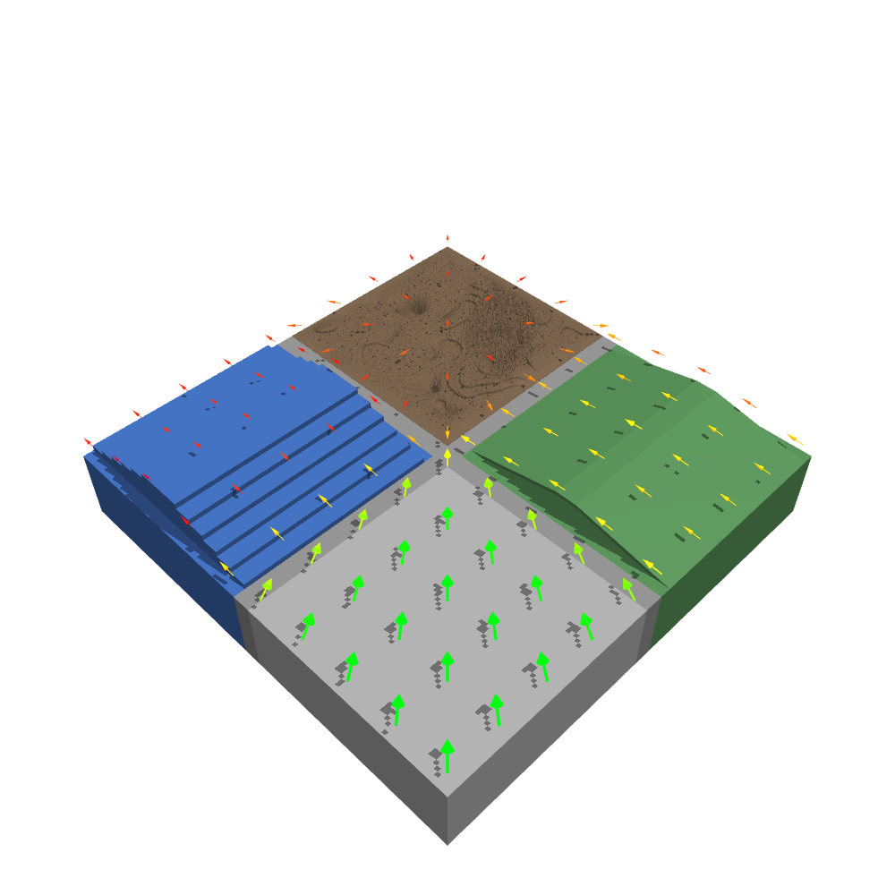

# Velocity Maps

A **velocity map** is a sampled 3D vector field over a terrain. At points across
every tile, it stores a direction (toward a goal, with an optional per-tile radial
component) and a speed. The local tile type, the surface grade, and the roughness
slow the speed. Use a velocity map to author and visualize target-velocity fields
for locomotion tasks, and as an input to velocity-tracking rewards.

<div style="text-align: center;">
  
  <div><i>A velocity field over a tiled course. Arrows point toward the goal, colored red (slow) to green (fast).</i></div>
</div>

The subsystem has two modules:

- **`myoassist_terrains.velocity_map`** builds the field from a `TerrainConfig`. It
  needs no MuJoCo model. It requires a **tiled** terrain: sampling is per cell, and a
  [uniform surface](uniform) has none, so passing one is rejected with a message
  saying so.
- **`myoassist_terrains.velocity_arrows`** turns a field into red-to-green arrow
  geoms for an MJCF scene.

## Building a field

```python
from pathlib import Path
from myoassist_terrains.config import load_config
from myoassist_terrains.velocity_map import generate_velocity_map

config  = load_config(Path("utils/configs/myoassist_base.json"))
samples = generate_velocity_map(
    config,
    start=(-10.0, -10.0, 0.0),
    goal=(10.0, 10.0, 0.0),
    samples_per_tile=8,
    mode="tile",          # "goal": every arrow points at the goal;
                          # "tile": add a per-tile radial component
)
# each sample is a VelocitySample: row, col, tile_type,
#   position=(x, y, z), velocity=(vx, vy, vz), speed
```

`generate_velocity_map` returns a `list[VelocitySample]`. The main knobs are:

| Parameter | Meaning |
|-----------|---------|
| `start`, `goal` | World `(x, y, z)`. The horizontal direction points from each sample toward `goal`. |
| `samples_per_tile` | Grid density per tile (`n × n` samples). `1` places its single sample at the tile centre. |
| `base_speed` | Speed on flat terrain, before per-tile and grade scaling. |
| `speed_scale` | Override the per-tile-type multiplier. The defaults come from the tiles themselves, each of which declares its own, so a custom tile registered with `register_tile(..., speed_scale=...)` is covered automatically (flat `1.0` down to gap `0.25`). |
| `mode` | `"goal"` (straight to the goal) or `"tile"` (blend in a radial component). |
| `tile_radial_mode` | For `mode="tile"`: `"inward"`, `"outward"`, or `"mixed"`. |
| `smooth_speeds` | Spatially smooth neighboring sample speeds. |
| `tile_speed_jitter`, `tile_jitter_seed` | Deterministic per-tile speed variation in `[1-j, 1+j]`, so identical tile types still read distinctly. |
| `height_offset` | Lift samples above the surface for arrow placement. |

Surface heights come from the tiles themselves. Each tile reports its own, in the same
module as the code that places its geometry, so the arrows sit on the surface the
terrain actually has. For your own lookups use
[`surface_height_at(config, x, y)`](configuration#asking-where-the-ground-is), which
also handles uniform terrain and reports the height of the connector strips between
cells.

## Rendering arrows

`add_velocity_overlay(worldbody, asset, samples, *, emission=0.0, color_bins=32)`
appends a shaft-and-cone arrow per sample to an existing scene's `<worldbody>` and
`<asset>`. The arrows do not collide (`contype`/`conaffinity` = 0). They are colored
red (slow) to green (fast) across the observed speed range. Set `emission > 0` to
make them self-illuminate against the terrain. Call this function after the terrain
and model geoms are in the scene, so the name-uniqueness checks pass.

## Ready-to-run renderers

Two scripts under `utils/render/` drive the above end to end. They need the
`[render]` extra for `mediapy`.

```bash
# Terrain-only velocity overlay from a terrain config.
python utils/render/render_velocity_map.py \
    --terrain-config utils/configs/myoassist_base.json \
    --start -10 -10 0 --goal 10 10 0

# Terrain (with optional --arrows) and no musculoskeletal models; free or fixed
# camera. --emit-xml writes a viewer-ready scene instead of rendering.
python utils/render/render_terrain_check.py \
    --config utils/render/terrain5x5_velocity.json \
    --arrows --free --elevation -90 --distance 130
```
