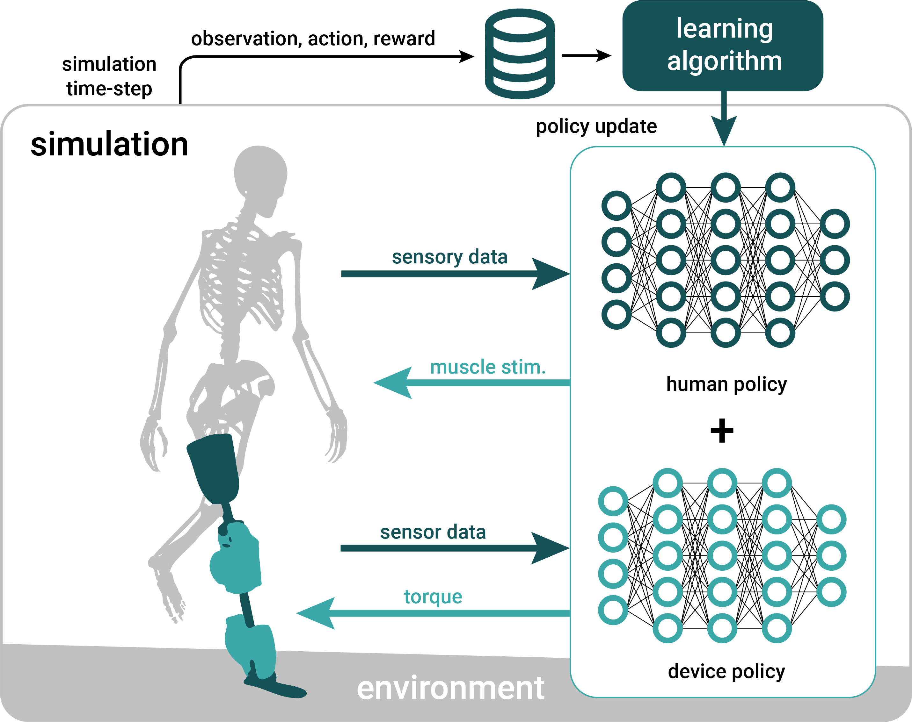
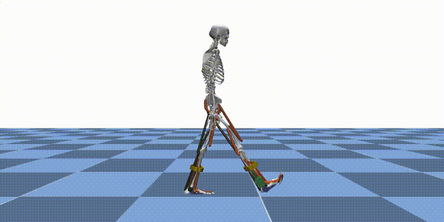
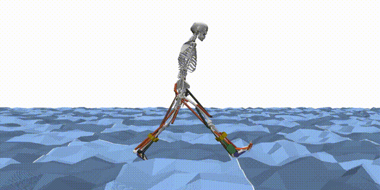
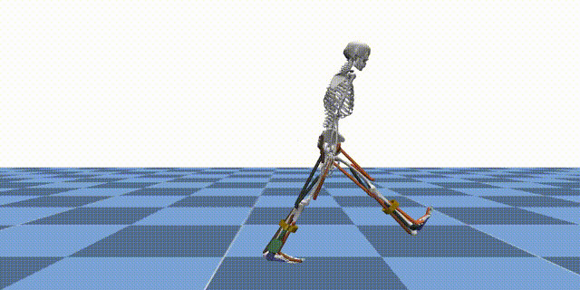
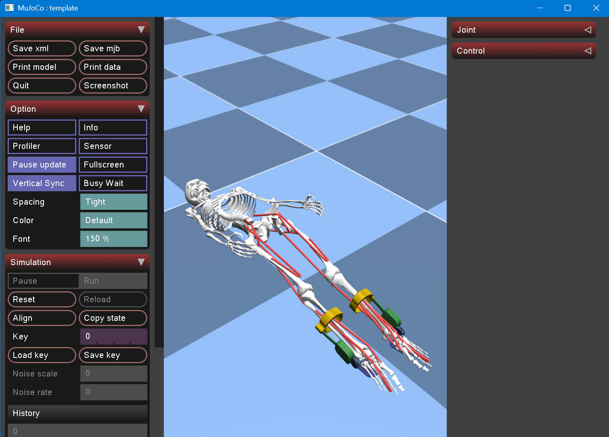
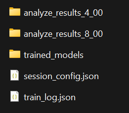
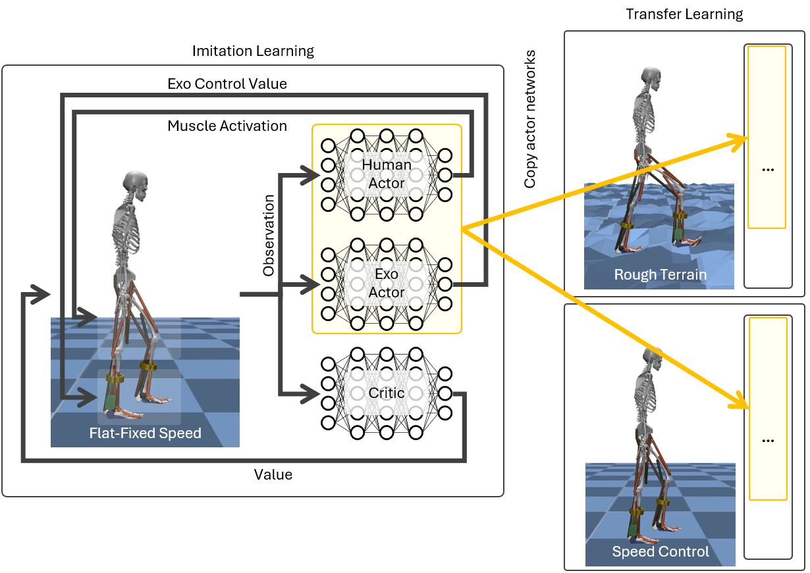
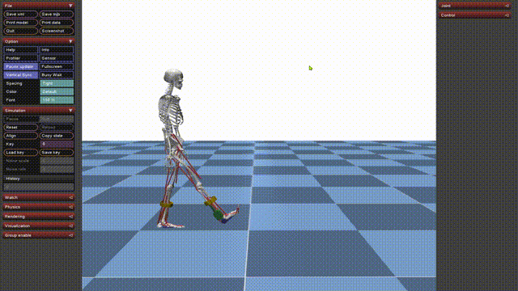
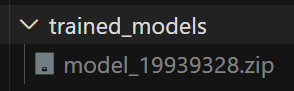

# Reinforcement Learning

MyoAssist’s reinforcement learning (RL) pipeline uses **[Stable-Baselines3 (SB3) PPO](https://stable-baselines3.readthedocs.io/en/master/index.html)** and custom **[MuJoCo](https://mujoco.org/)** environments. These environments simulate human–exoskeleton interaction. This page gives an overview of how the parts fit together and where to find more information.

<p align="center">
  
</p>

Reinforcement learning (RL) is a machine learning method. An agent learns to make decisions. It interacts with an environment and receives rewards as feedback. In MyoAssist, RL trains control policies for human–exoskeleton systems in MuJoCo simulation environments.

**Observation Space:**  
In our environments, the agent receives observations that include:
- Joint angles
- Joint velocities
- Muscle activations
- Sensory data (such as ground contact, force sensors, etc.)
- Target velocity (the last observation component)

**Action Space:**  
The agent outputs actions that control:
- Muscle activations (for the human actor network)
- Exoskeleton control values (for the exoskeleton actor network)


## Training Workflow

1. **Define a config**: start from an existing JSON preset, or create one from scratch.
2. **Launch training**
   ```bash
   python rl_train/run_train.py --config_file_path rl_train/train/train_configs/my_config.json
   ```
3. **Monitor progress**: logs and results go to `rl_train/results/train_session_*`.
4. **Evaluate policy**:
   ```bash
   python rl_train/run_policy_eval.py rl_train/results/train_session_<timestamp>
   ```
5. **Analyze results**: see [Evaluation](../evaluation/) for the shared eval outputs.

---

## Key Features

- **Multi-Actor Support**: Separate networks for human muscles and exoskeleton actuators (see [Network Index Handler](04_network-index-handler)).
- **Variable Terrain**: Train on flat, sloped, rough, or tiled terrain, defined by [Terrains](../modeling/terrains/).
- **Reference Motion Imitation**: Optional imitation reward using ground-truth gait trajectories.
- **Realtime Evaluation**: Run policies in realtime with `--flag_realtime_evaluate`.

<div style="display: flex; justify-content: center; align-items: center; gap: 24px;">
  <div style="flex: 1; text-align: center;">
    
  </div>
  <div style="flex: 1; text-align: center;">
    
  </div>
  <div style="flex: 1; text-align: center;">
    
  </div>
</div>

---

# Getting Started

This guide shows you the fastest way to test the RL system and run training in the MyoAssist RL system.

## RL Training Entry Points

Here is a quick overview of the main entry point scripts in the [`rl_train`](https://github.com/neumovelab/myoassist/tree/main/rl_train/) folder:

| File | Purpose |
|------|---------|
| [`run_sim_minimal.py`](https://github.com/neumovelab/myoassist/blob/main/rl_train/run_sim_minimal.py) | The simplest way to create and test a MyoAssist RL environment. No training, just environment creation and random actions. |
| [`run_train.py`](https://github.com/neumovelab/myoassist/blob/main/rl_train/run_train.py) | Main entry point for running RL training sessions. Loads configuration, sets up environments, and starts training. |
| [`run_policy_eval.py`](https://github.com/neumovelab/myoassist/blob/main/rl_train/run_policy_eval.py) | Entry point for evaluating and analyzing trained policies. Useful for testing policy performance and generating analysis results. |


## Quick Test Commands

### 1. Environment Creation Example

See how to create a simulation environment and run for 150 frames(5sec):

```bash
python rl_train/run_sim_minimal.py
```

- mac:
```bash
mjpython rl_train/run_sim_minimal.py
```
> **Note:**
If you need MuJoCo visualizer in mac os, simply use `mjpython` instead of `python` to run your script.  
You do not need to install anything extra. Just change the command:

> **Note:**  
If you see the error message `ModuleNotFoundError: No module named 'flatten_dict'`, simply run the command again. This will usually resolve the problem automatically.


<!-- -->

<p align="center">
  
</p>

**What this does:**
- Shows an example of creating a Gym wrapped MuJoCo simulation environment
- No actual training - just environment creation example


> Terminated vs Truncated [In-depth explanation of the terminated and truncated values in Gymnasium's Env.step API](https://farama.org/Gymnasium-Terminated-Truncated-Step-API)

### 2. Quick Training Test

Run a minimal training session to verify everything works:
```bash
python rl_train/run_train.py --config_file_path rl_train/train/train_configs/test.json --flag_rendering
```
<!-- ```bash
python rl_train/run_train.py --config_file_path rl_train/train/train_configs/imitation_tutorial_22_separated_net_partial_obs.json --config.total_timesteps 12 --config.env_params.num_envs 1 --config.ppo_params.n_steps 4 --config.ppo_params.batch_size 4 --config.logger_params.logging_frequency 1 --config.logger_params.evaluate_frequency 1 --flag_rendering
``` -->

**What this does:**
- Runs actual reinforcement learning training
- Training for only a few short timesteps
- Uses 1 environment (minimal resource usage)
- Enables rendering to see the simulation
- Logs results after every rollout (256 steps, `test.json`) for immediate feedback

### 3. Check Results

After training, check the results folder:

```bash
# Results location
rl_train/results/train_session_[date-time]/
```
<p align="center">
  
</p>

Concurrent runs never share a directory. Training claims `train_session_[date-time]`, and steps to `train_session_[date-time]_1`, `_2`, and so on when the second-resolution timestamp is already taken.

**What you'll find:**
- `analyze_results_[timesteps]_[evaluate_number]`: analysis written during training, by the analyzer that the learning callback runs every `logger_params.evaluate_frequency` rollouts
- `session_config.json`: Configuration used for this training
- `train_log.json`: Training log data
- `trained_models/`: Trained models(`.zip`) saved at each log interval - can be used for evaluation or transfer learning

`run_policy_eval.py` writes `analyze_results_[NN]` instead, without the timestep prefix.

## Full Training (When Ready)

Turn the model cache on first. Each of the `num_envs` workers composes its own model, so
training without the cache is much slower:

```bash
export MYOASSIST_CACHE_DIR=~/.cache/myoassist
```

The variable covers RL and controller optimization. See
[Caching](../modeling/devices/exporting-and-loading#caching).

Once you've verified everything works, run full training:

```bash
python rl_train/run_train.py --config_file_path rl_train/train/train_configs/imitation_tutorial_22_separated_net_partial_obs.json
```

This file is the default example configuration we provide.  
For more details, see the [RL Configuration](02_configuration) section.

> **Note:**  
> The provided config sets `num_envs` to 32.  
> Depending on your PC's capability, try lowering this to 4, 8, or 16.  
> You should also adjust `n_steps` accordingly.  
> For example, if you use `num_envs=16` (half of 32), you should double `n_steps` to keep the total batch size the same.


## Policy Evaluation

Test a trained model:

```bash
python rl_train/run_policy_eval.py [path/to/trainsession/folder]
```

> Point `run_policy_eval.py` at any `train_session_*` directory that you produced.

| Flag | Meaning |
|------|---------|
| `--steps N` | Override `num_timesteps` for every rollout. The configs ship 200 steps, about 5 strides. Works on already-trained sessions. |
| `--regen` | Regenerate the evaluated gait data even if it already exists. |
| `--no-show` | Skip the pop-out composite window. |
| `--varying` | Replace `evaluate_param_list` with a single SINUSOIDAL 0.8-1.4 m/s rollout and emit the speed-tracking composite. |
| `--cmap {rainbow,teal,bluered}` | Speed color map for varying-speed composites. |
| `--legacy-plots` | Also write the legacy per-panel PNGs. |


After training, an `analyze_results` folder will be created inside your `train_session` directory.  
This folder contains various plots and videos that visualize your agent's performance.

- **Where to find:**  
  ```
  rl_train/results/train_session_[date-time]/analyze_results_[NN]/
  ```
- **What's inside:**  
  - `composite.png` (and `.svg`), `replay.mp4`, and `gait_evaluated_data.json`
  - See [Evaluation](../evaluation/) for the full description of these outputs.


The parameters used for evaluation and analysis (such as which plots/videos are generated) are controlled by the `evaluate_param_list` in your `session_config.json` file.

For more details on how to customize these parameters, see the [RL Configuration](02_configuration) section.


## Transfer Learning


```bash
python rl_train/run_train.py --config_file_path [path/to/transfer_learning/config.json] --config.env_params.prev_trained_policy_path [path/to/pretrained_model]
```

or you can specify the `env_params.prev_trained_policy_path` in config(.json) file

> **Note:** The `[path/to/pretrained_model]` should point to a `.zip` file, but do not include the `.zip` extension in the path.


## Realtime Policy Running
You can run a trained policy in realtime simulation:
<p align="center">
  
</p>

- windows:
```bash
python rl_train/run_train.py --config_file_path [path/to/config.json] --config.env_params.prev_trained_policy_path [path/to/model_file] --flag_realtime_evaluate
```

- mac:
```bash
mjpython rl_train/run_train.py --config_file_path [path/to/config.json] --config.env_params.prev_trained_policy_path [path/to/model_file] --flag_realtime_evaluate
```


**Parameters:**
- `[path/to/config.json]`: Path to the JSON file in the train_session folder
- `[path/to/model_file]`: Path to the model file (.zip) without extension. It is located in the train_models folder
<p align="center">
  
</p>

> Use a `session_config.json` and a `model_<steps>` file from a `train_session_*` directory that you produced.
